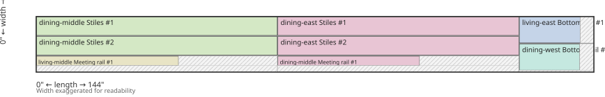

# Plan: Lumber Cut Optimizer

A Python tool that takes **stock lumber** and either a handwritten **cut list** or **window openings**, then outputs **which cuts to take from which board**.

This plan incorporates every decision from the original design plus later changes (storm windows, kerf, shop PDF, per-window cut tables, cross-cut-first / gang-rip sequence, cuts-from-openings, mixed-length packing, shorter rips on 12' and 10' boards).

---

## 1. Problem definition

This is a **2D cutting-stock** problem on the **face** of each board, solved with a shop-realistic workflow: **rip to width, then cross-cut to length**.

| Axis | Meaning | Example |
|------|---------|---------|
| **Length** | Along the grain (primary cut direction) | 144" (12') |
| **Width** | Cross-grain (ripping) | 7 3/8" |
| **Thickness** | Fixed; omitted from input | 1" (4/4) |

Each stock piece is a rectangle **W × L**. Each cut needs **w × l**. Pieces are **not** rotated 90° (grain stays aligned with board length).

### Live example: six storm windows

**Stock** (all 4/4, 1" thick) — `examples/storm_window.yaml` / `.json`:

| ID | Width | Length |
|----|-------|--------|
| board-a | 7 3/8 | 144 (12') |
| board-b | 7 | 144 (12') |
| board-c | 8 3/8 | 120 (10') |
| board-d | 7 1/4 | 120 (10') |
| board-e | 6 1/8 | 120 (10') |
| board-f | 4 3/4 | 97 1/2 (8' 1 1/2") |
| board-g | 4 7/8 | 97 (8' 1") |
| board-h | 5 1/2 | 97 (8' 1") |

**Openings** (section 16) derive **30 pieces**: 12 stiles @ 62 1/4" × 2 1/8", plus top / meeting / bottom rails per window. Part widths: stile and top rail **2 1/8"**, meeting rail **1 1/4"**, bottom rail **3 1/2"**.

**Result with the current packer:** all **30 pieces place**; **6 of 6** windows complete; waste about **30%** on used boards. Used: board-a, board-b, board-d, board-e. Unused leftover: board-c (wide 10'), board-f, board-g, board-h. 10' boards are through-cut (62 1/4" blank + 57 5/8" leftover), not a 10' rip.

### Historical fixture: three windows on three 8' boards

`examples/storm_window.craftsmanblog.yaml` keeps the original 2-small + 1-large list (1 11/16" stiles, 15 pieces). Under rip-then-crosscut that stock still places **14 of 15**; the 38 1/4" top rail is unplaced. Tests for shortage, gang-rip, and whole-board cross-cut-first use this file.

---

## 2. Confirmed design decisions

| Decision | Choice | Source |
|----------|--------|--------|
| Thickness | All stock and cuts are **1"**; thickness is not an input field | User |
| Cut workflow | Default: **rip to width**, then **cross-cut to length**. Same-length board → cross-cut first (section 14). Adjacent same-length-only strips → gang-rip (section 15). On **12' and 10' boards**, pack leftover length so a **through cross-cut** shortens the rip (section 18) | User |
| Grain rotation | **Not allowed** | Original plan default |
| Kerf | First-class input, default **1/8"**, overridable in the file and via `--kerf` | User question + original plan |
| Project type | **Storm windows** (stiles, top rail, meeting rail, bottom rail) | User correction (not door frames) |
| Window count | **Six openings**: dining west/middle/east + living west/middle/east (section 16) | User |
| Expansion clearance | Subtract **1/4"** from opening height and width so the finished frame can swell | User |
| Frame joinery | Stiles run full height; rails sit **between** the stiles | User + original cut list |
| Shortage behavior | Place what fits; print **INSUFFICIENT STOCK** and list unplaced pieces; CLI exit code 1 | User |
| Input format | YAML or JSON problem file | Original plan (CSV deferred) |
| Inch math | `fractions.Fraction` (exact `4 3/4`, `1 11/16`) | Original plan |
| Optimizer | Two-stage greedy: pack strips **per stock length** (longest first), then widest-strip / tightest-width onto boards of that length (section 17) | User + mixed 12'/10'/8' stock |
| Objective | Maximize pieces placed, then tightest width fit (widest strips first) | Needed so wide rails claim width before stiles |
| 12' / 10' rips | Through-cut station blanks so rips are 62 1/4" (12': two stations + 19 1/4" leftover; 10': one station + 57 5/8" leftover). 8' stock stays rip-first / cross-cut-first / gang-rip | User |
| Shop report | **PDF** with instructions, per-board diagrams, **windows completed**, **unused stock**, and a **per-window cut table** (opening H×W plus each part’s L×W×qty; mixed numbers with `"` in one cell) | User |

---

## 3. Kerf

Kerf is consumed on every new cut, not treated as waste after the fact.

- **Rip cuts:** each additional strip on a board uses `width + kerf` of stock width (the first strip has no leading kerf).
- **Cross cuts:** each additional piece on a strip uses `length + kerf` of stock length (the first piece on a strip has no leading kerf).
- **Default:** `kerf: "1/8"` in the problem file.
- **Override:** `lumber optimize file.yaml --kerf 3/16`.
- **Waste %** includes kerf as consumed material (`stock area − placed area`).
- **Feasibility:** three `1 11/16"` strips from a `5 1/2"` board require `3 × 1 11/16 + 2 × kerf ≤ 5 1/2`.

Same kerf is used for rip and cross-cut. No extra fudge factor.

---

## 4. Input format

One problem file (YAML or JSON). Thickness is implicit.

### Stock

| Field | Required | Meaning |
|-------|----------|---------|
| `width` | yes | Face width (cross-grain) |
| `length` | yes | Length along the grain |
| `id` | no | Label (defaults to `board-1`, `board-2`, …) |
| `quantity` | no | Identical boards (default `1`) |

### Cuts

| Field | Required | Meaning |
|-------|----------|---------|
| `name` | yes | Part label |
| `length` | yes | Finished length along the grain |
| `width` | yes | Finished width after ripping |
| `quantity` | no | How many of this part (default `1`) |

Sets of windows are usually **not** typed as `cuts`. Prefer `windows` + `parts` (section 16); the loader derives named pieces (`dining-west Stiles`, …). A handwritten `cuts:` list is still valid; do not put both `windows` and `cuts` in one file.

### Windows (optional; mutually exclusive with `cuts`)

| Field | Required | Meaning |
|-------|----------|---------|
| `expansion` | no | Clearance subtracted from opening height and width (default `1/4`) |
| `parts.stile.width` | yes if `windows` | Ripped stile width |
| `parts.top_rail.width` | yes if `windows` | Top rail width |
| `parts.meeting_rail.width` | yes if `windows` | Meeting rail width |
| `parts.bottom_rail.width` | yes if `windows` | Bottom rail width |
| `windows[].id` | no | Label (defaults to `window-1`, …) |
| `windows[].height` | yes | Opening height |
| `windows[].width` | yes | Opening width |
| `windows[].meeting` | no | Sill-to-meeting-rail height (glazing later; not used for lumber lengths) |

Dimensions are fractional inch strings (`4 3/4`, `1 11/16`, `1/8`). Decimals are accepted. Lengths in the file are **inches** (`144` for 12').

See `examples/storm_window.yaml` and `examples/storm_window.json`. The three-board handwritten list is `examples/storm_window.craftsmanblog.yaml`.

---

## 5. Optimization strategy

### Implemented: two-stage rip-then-crosscut packer

Matches how a table saw is used: rip full-length strips, then cross-cut those strips.

1. Expand stock and cuts by quantity (or expand `windows` → cuts first).
2. Group remaining pieces by **finished width**.
3. For each distinct stock **length** (longest first), pack remaining pieces into strips that fit **that** length, then assign those strips only to boards of that length (widest strip first, tightest remaining-width fit, kerf between rips).
4. Pieces that still have no board after every length class → **unplaced**.

This is Phase 1 of the original plan, specialized to guillotine rip strips (not free 2D nesting), then extended for mixed 12' / 10' / 8' stock (section 17).

**Why not longest-first 2D packing?** Placing all 62 1/4" stiles first can fill every stile-width slot and leave no width for wider bottom rails. Widest-strip-first avoids that.

**Why pack per board length?** Two 62 1/4" stiles plus kerf need 124 3/4". That fits a 12' board and does **not** fit a 10' board as a pair. Packing every strip against the longest board left 10' stock unused while stiles were reported unplaced. Length-class packing pairs stiles on 12' boards, then puts remaining stiles one-per-strip on 10' boards.

### Deferred (original plan Phase 2–3)

| Item | Status | Why deferred |
|------|--------|--------------|
| OR-Tools CP-SAT / MIP | Not started | Greedy places the live 30-piece list; 14/15 bound still holds for the 3-board fixture |
| Column generation | Not started | Same |
| CSV input | Not started | YAML/JSON covers the workflow |
| ASCII/SVG as a standalone format | Superseded | Replaced by the markdown report + board diagram (section 12) |
| Mixed thickness | Out of scope | All 1" |
| Separate rip vs cross-cut kerf | Not needed | One blade width is enough |
| Minimum offcut size / scrap inventory | Not started | Optional later |

---

## 6. Feasibility notes

### Live six-window list (eight boards)

Under rip-then-crosscut with **per-length** strip packing:

- Two 62 1/4" stiles share a **12'** strip (`62 1/4 + kerf + 62 1/4 = 124 3/4" ≤ 144"`).
- The same pair does **not** share a **10'** strip (`124 3/4" > 120"`), so leftover stiles go one-per-strip on 10' boards (section 17).
- Bottom rails (3 1/2") take a 12' strip on board-b; stiles and top rails fill remaining 12' and 10' width.

**Result: 30 of 30 pieces place; 6 of 6 windows complete; ~30% waste on used boards.** Unused leftover: board-c, board-f, board-g, board-h. 10' boards through-cut (section 18), not full-length rips.

### Historical three-window list (three 8' boards)

`examples/storm_window.craftsmanblog.yaml` — original 1 11/16" stiles:

- Two 62 1/4" stiles cannot share a 97 1/2" strip (`62 1/4 + 62 1/4 + kerf > 97 1/2`).
- A 62 1/4" stile cannot share a strip with a 38 1/4" rail (`62 1/4 + 38 1/4 + kerf > 97 1/2`).
- So **all 1 11/16" pieces** need **7 strips**: 6 exclusive stile strips + 1 exclusive large-top-rail strip (the two 17 1/4" top rails fit on stile remnants).
- Three boards can supply at most **7** strips of 1 11/16" **if every remaining width is used for those strips**.
- The 2 9/16" bottom rails need their own strip. That strip costs enough width that at most **6** strips of 1 11/16" remain.

**Result: 14 of 15 pieces place; the 38 1/4" × 1 11/16" top rail is unplaced.** The program reports that shortage.

The two small windows alone (10 pieces, no 38 1/4" rails) **all fit**.

Getting the 15th piece on that three-board pile would require a different shop workflow (cross-cut into length sections first, then rip each section). That is still out of scope **for recovering the 15th piece**. Using the same idea on **12' boards** so rips are not 12 feet long **is** requested (section 18).

---

## 7. Module layout

Environment: **uv** (`uv.lock`, `uv sync`). Python **3.11+**.

```
lumber/
├── pyproject.toml
├── uv.lock
├── .python-version          # 3.12
├── README.md
├── PLAN.md                 # this document
├── lumber/
│   ├── __init__.py
│   ├── __main__.py         # python -m lumber
│   ├── dimensions.py       # parse/format fractional inches
│   ├── models.py           # StockPiece, CutPiece, Placement, CutPlan, Problem
│   ├── io.py               # load YAML/JSON
│   ├── validate.py         # feasibility checks + quantity expansion
│   ├── packer.py           # rip/cross-cut packer (per stock length)
│   ├── sequence.py         # rip-first, cross-cut-first, gang-rip
│   ├── windows.py          # openings → cut list; window completion
│   ├── report.py           # text + JSON + markdown
│   ├── diagram.py          # board face geometry (SVG; PDF reuse)
│   ├── pdf.py              # PDF shop report
│   └── cli.py
├── examples/
│   ├── storm_window.yaml   # live: 6 openings, 8 boards
│   ├── storm_window.json   # same as yaml
│   └── storm_window.craftsmanblog.yaml  # 3-window handwritten cuts
└── tests/
    ├── test_dimensions.py
    ├── test_validate.py
    ├── test_packer.py
    ├── test_storm_window.py
    ├── test_windows.py
    ├── test_diagram.py
    ├── test_sequence.py
    ├── test_pdf.py
    └── test_cli.py
```

**CLI:**

```bash
uv run lumber optimize examples/storm_window.yaml
uv run lumber optimize examples/storm_window.json
uv run lumber optimize examples/storm_window.yaml --format json
uv run lumber optimize examples/storm_window.yaml --format markdown -o storm_window.md
uv run lumber optimize examples/storm_window.yaml --format pdf -o storm_window.pdf
uv run lumber optimize examples/storm_window.yaml --kerf 1/8 -o plan.txt
uv run python -m lumber optimize examples/storm_window.yaml
```

Exit code **0** if every piece is placed, **1** if any are unplaced or validation fails.

---

## 8. Output

Human-readable cut list (primary):

```
LUMBER CUT PLAN
Kerf: 1/8"

Board: 7 3/8" x 1" x 144" (board-a)
  Sequence: through cross-cut (shorten 12' rips)
  Cross-cut @ 0" + 62 1/4" -> blank A
    ...
  Leftover blank: 19 1/4" x 7 3/8"
    Rip @ 0" -> 3 1/2" strip
    ...

Placed: 30 pieces
Waste: … sq in (…%)
Windows completed: 6 of 6
Complete: dining-east, dining-middle, dining-west, living-east, living-middle, living-west
Unused stock: board-f, board-g, board-h
```

When pieces do not fit (three-board fixture):

```
Placed: 14 pieces
INSUFFICIENT STOCK: 1 piece(s) could not be placed
UNPLACED:
  Top Rail #3: 38 1/4" x 1 11/16"
```

JSON includes placements, unplaced pieces, `placed` count, waste, and when openings were used: `windows_completed` / `windows_total` / complete and incomplete ids, plus `unused_stock`.

Markdown + sibling SVGs (section 12) exist as an optional format. The **shop-facing deliverable is a PDF** (section 13): one file with instructions, graphics, windows completed, unused stock, and a per-window cut table.

---

## 9. Test plan (coverage)

| Test | Status |
|------|--------|
| Dimension parser: `4 3/4` → `Fraction(19, 4)`; round-trip format | Done |
| 1D trivial: two lengths on one strip with kerf | Done |
| Kerf too large: second piece unplaced | Done |
| Kerf sensitivity: 1/8" vs 1/4" changes how many 1 11/16" strips fit in 5 1/2" | Done |
| No overlapping placements | Done |
| Rip kerf across width | Done |
| Validation: cut wider than stock | Done |
| Two small windows: all 10 pieces placed | Done |
| Three-board fixture: 14 placed, 38 1/4" top rail unplaced, `INSUFFICIENT STOCK` | Done |
| Live six-window list: 30 placed, 6 of 6 windows complete | Done |
| Mixed stock lengths: leftover stiles pack onto shorter boards (not only the longest) | Done |
| CLI: text/json, `--kerf`, exit code 1 when short, exit 0 when complete | Done |
| Markdown report writes a `.md` with heading, summary, and unplaced list | Done |
| Each used board has a face diagram (pieces, kerf gaps, offcut) | Done |
| Diagram placements match packer coordinates (no overlap, in-bounds) | Done |
| PDF report writes a `.pdf` with summary, per-board diagram, and cut list | Done |
| PDF includes unplaced / INSUFFICIENT STOCK when stock is short | Done |
| PDF diagrams use the same `board_regions` geometry as the SVG | Done |
| Same-length board: instructions are cross-cut then rip (board-c stiles) | Done |
| Mixed-length board: instructions stay rip then cross-cut (craftsmanblog board-a) | Done |
| Adjacent same-length-only strips: gang-rip, cross-cut, then split (board-b stiles) | Done |
| Same-length leftover is one full-width offcut, not long narrow strips | Done |
| Derive cut list from window openings (height/width − 1/4", rails between stiles) | Done |
| PDF/text/markdown report how many windows are complete and which stock is unused | Done |
| PDF per-window cut table: opening H×W plus part L×W×qty; each measurement one cell with `"` (`62 1/2"`, not `62` \| `1/2`) | Done |
| 12' boards: through cross-cut so rips are not full length; small parts in the leftover (section 18) | Done |
| 10' boards: one station + leftover (no 10' rip); wide unused 10' stock listed leftover | Done |
| OR-Tools golden comparison | Deferred with Phase 2 |

---

## 10. Implementation status

| Step | Task | Status |
|------|------|--------|
| 1 | `dimensions.py` + tests | Done |
| 2 | `models.py`, `io.py` | Done |
| 3 | `validate.py` | Done |
| 4 | Rip-then-crosscut packer (widest-first; per stock length) | Done |
| 5 | `report.py`, `cli.py`, `python -m lumber` | Done |
| 6 | Live example (6 windows, 8 boards) + 3-window craftsmanblog fixture | Done |
| 7 | Insufficient-stock reporting | Done |
| 8 | Kerf override + kerf tests | Done |
| 9 | OR-Tools packer | Deferred |
| 10 | Markdown shop report with per-board cut diagrams | Done |
| 11 | PDF shop report with instructions and cut graphics | Done |
| 12 | Cross-cut first when all pieces on a board share one length | Done |
| 13 | Gang-rip adjacent same-length strips, then cross-cut, then split | Done |
| 14 | Derive storm-window cuts from opening measurements (section 16) | Done |
| 15 | Pack strips per stock length so 10' / 8' boards get leftover stiles (section 17) | Done |
| 16 | Report windows completed and unused stock on the shop cutsheet | Done |
| 17 | 12' boards: pack small parts into leftover length; through cross-cut, then shorter rips (section 18) | Done |
| 18 | PDF per-window cut table (opening size + part list; mixed numbers with `"` in one cell) | Done |
| 19 | 10' boards: one 62 1/4" station + 57 5/8" leftover (no 10' rip); skip unused wide 10' stock | Done |

---

## 11. Success criteria

- Loads the eight-board stock and six openings from YAML or JSON and derives the 30-piece cut list
- Handwritten `cuts:` files still load (`storm_window.craftsmanblog.yaml`)
- Outputs an explicit **board → rip → cross-cut** sequence (cross-cut-first or gang-rip when those rules apply)
- Accounts for kerf on rips and cross-cuts
- Reports waste percentage, **windows completed**, and **unused stock**
- Places every piece that fits this workflow, and **lists what cannot be done** (14/15 on the three-board fixture)
- Two-window subset of the old list still places all 10 pieces
- Live six-window list places all 30 pieces on boards a–e
- Can write a `.md` shop report that shows, for each used board, where every cut sits on the face
- Can write a single **PDF** with those instructions and graphics, suitable to print or open without a Markdown preview
- PDF lists each window’s opening and derived cuts (length, width, quantity) with mixed numbers and a `"` inch mark in a single cell per measurement
- When every piece on a board is the same length, shop instructions **cross-cut that length first**, then rip, so leftover is a full-width offcut
- When adjacent strips hold only same-length parts, **rip them as one blank**, cross-cut, then rip apart, so leftover is a wider offcut
- From opening height/width, compute stile and rail **lengths** (1/4" expansion; rails between stiles) and feed the packer
- On 12' and 10' boards, **do not rip the full board** when leftover length can hold the remaining parts: through cross-cut first, then rip the shorter blanks (section 18)

---

## 14. Cross-cut first when a board’s pieces share one length

**Status:** implemented. Packer assignments stay as they are. This changes **how we tell you to cut** a board (and how the diagram is drawn), not which pieces land on which board.

### Problem (board-c in the three-board fixture)

In `storm_window.craftsmanblog.yaml`, `board-c` is 5 1/2" × 97 1/2" and gets three 62 1/4" × 1 11/16" stiles. Rip-first would say:

1. Rip three full-length 1 11/16" strips (97 1/2" rips)
2. Cross-cut each strip at 62 1/4"

That leaves **long, narrow scrap**: three ~35" × 1 11/16" remnants, plus a skinny full-length leftover along the 5 1/2" width. Ripping 8-foot strips for parts that are all the same length is also the cumbersome/unsafe case discussed earlier.

### Rule

For each used board, look at the finished **length** of every placed piece:

- **All lengths equal** (e.g. three 62 1/4" stiles) → **cross-cut first**, then rip
- **Mixed lengths** (craftsmanblog board-a) → keep **rip first**, then cross-cut. Live 12' boards with a usable leftover use section 18.
- **Mixed board with a same-length-only pair of strips** (board-b stiles) → section 15, not whole-board cross-cut first

“Same length” means the same finished part length. Kerf is not a part length.

### Shop sequence (same-length board)

Example, board-c, all parts 62 1/4":

1. **Cross-cut** the full 5 1/2" width at 62 1/4" (one through-cut; kerf after that cut)
2. **Rip** the 62 1/4" × 5 1/2" blank into the stile widths (1 11/16" + kerf + 1 11/16" + kerf + 1 11/16")
3. Leftover is **one** ~35 1/8" × 5 1/2" offcut (full width, shorter) — usable, not three skinny sticks

If several same-length pieces fit **end-to-end** on the board (e.g. all 17 1/4"), make one through cross-cut per station along the length (`length + kerf` between stations), then rip each blank.

### What does not change

- Which pieces the packer assigns to which board
- Mixed-length boards (still rip full-length strips, then cross-cut)
- The general “always cross-cut first on every board” idea (still out of scope for mixed 62 1/4" + 38 1/4" sharing one length). **12' leftover + small parts** is section 18.

### Reports (text, Markdown, PDF)

Same-length boards should read:

```
Board: 5 1/2" x 1" x 97 1/2" (board-c)
  Sequence: cross-cut first (all parts 62 1/4")
  Cross-cut @ 0" + 62 1/4" -> blank A
    Rip @ 0" -> 1 11/16" -> Stiles #4
    Rip @ 1 13/16" -> 1 11/16" -> Stiles #5
    Rip @ 3 5/8" -> 1 11/16" -> Stiles #6
  Offcut: 35 1/8" x 5 1/2" (full width)
```

The face diagram should show the **through cross-cut** and rips on the short blank, with leftover as a full-width rectangle — not three long rip strips.

### Implementation notes

- Helper: `shared_length(placements) -> Fraction | None` in `sequence.py`
- Instruction builder and diagrams branch on that (text, markdown, PDF)
- Tests: three equal-length stiles emit “cross-cut first”; mixed-length board-a in the fixture still “rip first”; leftover width equals stock width

On the **live** eight-board list, board-c and board-d often hold two same-length living-room stiles, so they also get whole-board cross-cut-first.

### Out of scope for this item

- Rewriting the packer to *prefer* grouping same-length pieces onto one board (nice later; not required for board-c today)
- Cross-cut-first on mixed-length boards (see section 18 for 12' leftover blanks)
- Changing kerf math for mixed-length rip-first boards

---

## 12. Markdown shop report with board diagrams

**Status:** implemented. This replaces the old “optional ASCII/SVG layout” item.

The program will write a **Markdown file** (e.g. `storm_window.md`) that a person can open in any editor or Git viewer and take to the saw. It is not a substitute for the packer — it only renders an already-computed `CutPlan`.

### Why Markdown

- One file: summary, cut list, and pictures together
- Renders in GitHub, Cursor, and most editors
- Easy to archive next to `examples/storm_window.yaml`

### CLI

```bash
uv run lumber optimize examples/storm_window.yaml --format markdown -o storm_window.md
```

- `--format markdown` (aliases: `md`) produces the report
- `-o` / `--output` writes the `.md` (if omitted, print to stdout)
- Text and JSON formats stay as they are

### File shape

```markdown
# Lumber cut plan

Kerf: 1/8"
Placed: 30 pieces
Waste: …
Windows completed: 6 of 6
Unused stock: board-f, board-g, board-h

## board-a — 7 3/8" × 1" × 144"



### Cuts
- Rip @ 0" → 2 1/2" strip
  - Cross-cut @ 0" + 62 1/4" → dining-middle Stiles #1
  - ...
```

When pieces do not fit, an **Unplaced** / `INSUFFICIENT STOCK` section is appended (three-board fixture). Used boards are drawn; unused boards appear only in the summary line.

### Diagram (one per used board)

Face view of the board, **to scale**:

| Axis on the page | Board axis | Why |
|------------------|------------|-----|
| Horizontal (left → right) | **Length** (grain) | Matches how you read a long board |
| Vertical (bottom → top, or top → bottom — pick one and keep it) | **Width** (rips) | Each rip strip is a horizontal band |

Each placed piece is a labeled rectangle at its `rip_offset` / `length_offset` with its finished `width` × `length`. Show:

- Part name and instance (`Stiles #1`)
- Finished size (`62 1/4" × 1 11/16"`)
- **Kerf** as a thin gap between strips and between cross-cuts (not labeled as a part)
- **Offcut / waste** as an unlabeled remainder so leftover length and leftover width are visible
- Board outline with overall width and length

**Format for v1:** one sibling `.svg` per used board, referenced from the Markdown with ``. Markdown previews (including Cursor) strip raw `<svg>` tags, so the graphic only shows when it is a linked image file. Open the `.md` in preview, not as raw source.

**Not for v1:** a separate `.svg` per board, interactive HTML, or a second packing algorithm. The diagram draws the **current rip-then-crosscut** layout.

### Implementation notes

- Add `lumber/diagram.py` to turn one board’s placements + stock size + kerf into an SVG string
- Add `format_markdown(plan)` and `write_markdown_report(plan, path)` in `report.py` (writes the `.md` and sibling `.svg` files)
- Scale: map inches to SVG user units (e.g. 1" = 8 px) with a max width so an 8-foot board fits on a page
- Tests: markdown contains `# Lumber cut plan`, one `##` heading per used board, `INSUFFICIENT STOCK` when unplaced; SVG rectangles match placement coordinates and stay inside the board

### Out of scope for this item

- Changing the packer to cross-cut-first (discussed separately; would change the diagram geometry)
- OR-Tools / CSV input

---

## 13. PDF shop report

**Status:** implemented. This is the **primary shop output**. Markdown/SVG (section 12) stays as an optional format; it failed as a take-to-the-saw document because Cursor/GitHub previews strip or hide inline SVG.

### Goal

One file, e.g. `storm_window.pdf`, that contains:

1. Title, kerf, placed count, waste, **windows completed** (when cuts have window ids), **unused stock**
2. **Cuts by window** (when openings were used): one table per window, two-up on the page
3. For each used board: a **drawn face diagram** (same geometry as today’s SVG) and the rip / cross-cut list
4. An **Unplaced** section with `INSUFFICIENT STOCK` when pieces do not fit

Open in any PDF viewer, print, or take to the shop. No Markdown preview required.

### CLI

```bash
uv run lumber optimize examples/storm_window.yaml --format pdf -o storm_window.pdf
```

- `--format pdf` produces the PDF
- `-o` / `--output` is **required** for PDF (binary; do not dump to the terminal)
- Text, JSON, and markdown formats stay as they are

### Page layout (US Letter, portrait)

```
Lumber cut plan
Kerf: 1/8"
Placed: 30 pieces
Waste: …
Windows completed: 6 of 6
Complete: dining-east, dining-middle, …
Unused stock: board-f, board-g, board-h

Cuts by window
  dining-west          dining-middle
  Height  62 1/2"           Height  62 1/2"
  Width   20 7/8"           Width   41 7/8"
  Stiles  62 1/4"  2 1/2"  2
  Top Rail 15 5/8"  2 1/2"  1
  …

board-a — 7 3/8" × 1" × 144"
[ diagram ]
Cuts
  Rip @ 0" → 2 1/2" strip
    …

board-c — 8 3/8" × 1" × 120"
  Sequence: cross-cut first (all parts 62 1/4")
  …
```

- One board per page when the diagram + cut list would overflow; otherwise pack multiple boards on a page if they fit
- Unused boards are listed in the summary, not drawn
- Diagram rules unchanged from section 12 (labels, kerf gaps, hatched offcut, optional “width exaggerated” note)

### Cuts by window

When the problem was loaded from `windows:` (cuts carry `window_id`), the PDF inserts a **Cuts by window** block after the summary and before the board diagrams. Handwritten `cuts:` files skip this block.

Each window is a small grid:

| Column | Opening rows | Part rows |
|--------|----------------|-----------|
| 1 | Height / Width | Stiles, Top Rail, Meeting rail, Bottom rail |
| 2 | Opening size (`62 1/2"`) | Part **length** (`62 1/4"`) |
| 3 | — | Part **width** (`2 1/2"`) |
| 4 | — | **Quantity** |

Do **not** split a mixed number across two cells (`62` | `1/2`). Whole number and fraction share one cell, same as `format_inches`, with a `"` suffix. No separate “inches” column.

Leave a gap between the window-id heading and the first grid row so descenders (`g` in dining, `g` in living) are not clipped by the cell fill.

Dining west (live 2 1/2" stiles) is the worked example: opening 62 1/2 × 20 7/8; stiles 62 1/4 × 2 1/2 × 2; rails 15 5/8 (top 2 1/2, meeting 1 1/4, bottom 3 1/2). Those lengths come from section 16, not from packing.

Openings are stored on `Problem` / `CutPlan` so the table can print original height and width, not only the derived pieces.

### Library

Use **ReportLab** (`reportlab` via `uv add reportlab`):

- Works on Windows without GTK/Cairo (WeasyPrint does not)
- Draws the board from `board_regions()` — same inches as the SVG, not a screenshot of HTML
- Writes text instructions in the same file

Do **not** shell out to a browser or require a system PDF printer.

### Implementation notes

- Add `lumber/pdf.py` with `write_pdf(plan, path)`
- Reuse `lumber.diagram.board_regions` for piece / kerf / waste rectangles; map inches to page points with a max diagram width (~7.5" on letter)
- CLI: `--format pdf`; error if `-o` is missing
- `uv add reportlab` (runtime dependency, not only dev)
- Tests: writing a PDF creates a file that starts with `%PDF`; the 3-window fixture PDF contains board ids and `INSUFFICIENT STOCK`; the live six-window PDF contains `Windows completed: 6 of 6`, unused stock, `Cuts by window`, dining-west, and mixed numbers with inch marks such as `62 1/2"` / `15 5/8"`; handwritten-cut PDFs omit the window tables; `window_cut_tables` groups the live six openings in file order

### Out of scope for this item

- Form-fillable PDFs, CNC toolpaths, or a second packing algorithm
- Changing the packer to cross-cut-first
- Replacing text/JSON/markdown (they remain)

---

## 15. Gang-rip adjacent same-length strips

**Status:** implemented. Packer assignments stay as they are. This is the board-b counterpart to section 14: the **whole board** is mixed length, but **two adjacent strips** are the same length only.

### Problem (board-b in the three-board fixture)

In `storm_window.craftsmanblog.yaml`, `board-b` is 4 7/8" × 97 1/2". Rip-first would say:

1. Rip a 1 11/16" strip the full 97 1/2" → cross-cut Stiles #2 at 62 1/4"
2. Rip another 1 11/16" strip the full 97 1/2" → cross-cut Stiles #3 at 62 1/4"
3. Rip the remaining 1 1/4" for meeting rails (38 1/4" + 17 1/4" + 17 1/4")

Stiles #2 and #3 are the **same length**, but we rip them **apart** for the full 8 feet first. After the 62 1/4" cross-cuts you get two **skinny** leftovers: about 35" × 1 11/16" each. That scrap is too narrow to be useful. The meeting-rail strip is a different length mix, so we cannot cross-cut the entire board first (section 14 does not apply).

### Intended sequence

Treat the two stile strips as **one blank** until after the length cut:

1. **Rip once** to the **combined width** of Stiles #2 + kerf + Stiles #3  
   `1 11/16 + 1/8 + 1 11/16 = 3 1/2"`  
   Do **not** split the two stiles yet.
2. **Cross-cut** that 3 1/2" strip at 62 1/4" (kerf between blank and leftover).
3. **Rip apart** the 62 1/4" × 3 1/2" blank into Stiles #2 and Stiles #3.
4. Rip the remaining 1 1/4" of board width as today for the meeting rails.

Leftover from the stile pair is **one** ~35 1/8" × **3 1/2"** offcut — wide enough to reuse — instead of two 1 11/16" sticks.

### Rule

On a board that is **not** all one length (section 14 already handled those):

- Group adjacent rip strips whose pieces are **all the same finished length** and that strip has **no other lengths** on it (a “same-length-only” strip).
- If two or more such strips sit next to each other and share that length, **gang** them:
  - Rip the group as one strip (sum of widths + kerfs between them)
  - Cross-cut to that length
  - Then rip the short blank into the individual parts
- Any leftover length of that gang strip is one offcut of the **combined width**
- Other strips on the same board (meeting rails on board-b) stay rip-then-cross-cut

Stiles #1 on board-a does **not** gang: that 1 11/16" strip also holds 17 1/4" top rails, so it is not same-length-only.

### Shop wording (board-b)

```
Board: 4 7/8" x 1" x 97 1/2" (board-b)
  Sequence: gang-rip Stiles #2 and #3 (same length 62 1/4")
  Rip @ 0" -> 3 1/2" pair strip
    Cross-cut @ 0" + 62 1/4" -> pair blank
      Rip @ 0" -> 1 11/16" -> Stiles #2
      Rip @ 1 13/16" -> 1 11/16" -> Stiles #3
    Offcut: 35 1/8" x 3 1/2"
  Rip @ 3 5/8" -> 1 1/4" strip
    Cross-cut @ 0" + 38 1/4" -> Meeting rail #3
    ...
```

The diagram should show the pair as one 3 1/2" band through 62 1/4", then the split on the short blank, with leftover **3 1/2" wide** (not two 1 11/16" remnants). Meeting-rail strip unchanged.

### What does not change

- Which pieces the packer assigns to which board
- Section 14 whole-board cross-cut-first (board-c)
- Mixed strips that already use remnant length for other parts (board-a stile + top rails)
- Meeting-rail sequence on board-b

### Implementation notes

- `sequence.iter_strip_runs` clusters adjacent same-length-only strips
- Instruction builder: gang cluster → rip combined → cross-cut → split; remaining strips as today
- Diagram leftover for a gang uses combined width after the through length cut
- Tests: board-b emits gang-rip / 3 1/2" pair / 3 1/2" offcut; board-a has no gang-rip; board-c still whole-board cross-cut first

### Out of scope for this item

- Rewriting the packer to create more gang-able pairs
- Ganging strips that are not adjacent
- Ganging strips that have mixed lengths on them

---

## 16. Storm window cuts from opening measurements

**Status:** implemented. The packer still consumes a flat cut list. `load_problem` **writes that cut list** from window openings plus stile/rail widths.

Cuts are named with the window id (`dining-west Stiles`). `CutPiece.window_id` is preserved through expand/pack so the shop report can count complete frames.

### Openings (from the house)

All six frames are **62 1/2" high**. Dining west/east match each other; living west/east match each other. Dining and living widths differ by **1/8"**, so they are not the same cut.

| Window | Height | Width | Meeting (sill to meeting rail) |
|--------|--------|-------|--------------------------------|
| Dining west | 62 1/2 | 20 7/8 | 31 1/2 |
| Dining middle | 62 1/2 | 41 7/8 | 31 1/2 |
| Dining east | 62 1/2 | 20 7/8 | 31 1/2 |
| Living west | 62 1/2 | 21 | 32 |
| Living middle | 62 1/2 | 42 | 32 |
| Living east | 62 1/2 | 21 | 32 |

**Meeting height** is where the meeting rail sits in the opening. It does **not** change lumber piece lengths. Keep it on the window record for later glass/glazing. Each window still gets one meeting-rail **piece**, same length as that window’s top and bottom rails.

### Part widths (unchanged)

These are the ripped board widths already in `examples/storm_window.json`:

| Part | Width (across the grain) | Per window |
|------|--------------------------|------------|
| Stile | 2 1/2 | 2 |
| Top rail | 2 1/2 | 1 |
| Meeting rail | 1 1/4 | 1 |
| Bottom rail | 3 1/2 | 1 |

Six windows → **12 stiles + 18 rails = 30 pieces**.

### Assembly and expansion

Stiles are the full height of the frame. Rails sit **between** the stiles (butt join). Finished frame must be **1/4" under** the opening on both axes so the wood can expand:

```
stile_length = opening_height − 1/4"
rail_length  = opening_width  − 1/4" − 2 × stile_width
```

Check against the original 1 11/16" stile list: dining west `20 7/8 − 1/4 − 2 × 1 11/16 = 17 1/4"`, dining middle `41 7/8 − 1/4 − 2 × 1 11/16 = 38 1/4"`, stile `62 1/2 − 1/4 = 62 1/4"`. That is how the first cut list was built. With today’s **2 1/2"** stiles the rails get shorter; the opening and the 1/4" clearance stay the same.

If rails were cut to `opening_width − 1/4"` (full frame width), the assembled frame would be two stile-widths **wider** than the opening and would not fit. So rail length is **not** simply width minus 1/4".

### Worked cut list (2 1/2" stiles)

`stile_length = 62 1/2 − 1/4 = 62 1/4"` for every window.

`rail_length = width − 5 1/4"` because `1/4 + 2 × 2 1/2 = 5 1/4`.

| Group | Windows | Stile L × W | Rail L | Top 2 1/2 | Meeting 1 1/4 | Bottom 3 1/2 |
|-------|---------|-------------|--------|-----------|---------------|--------------|
| Dining W+E | 2 | 62 1/4 × 2 1/2 (4) | 15 5/8 | 2 | 2 | 2 |
| Living W+E | 2 | 62 1/4 × 2 1/2 (4) | 15 3/4 | 2 | 2 | 2 |
| Dining middle | 1 | 62 1/4 × 2 1/2 (2) | 36 5/8 | 1 | 1 | 1 |
| Living middle | 1 | 62 1/4 × 2 1/2 (2) | 36 3/4 | 1 | 1 | 1 |

Stiles collapse to one line: **12** @ 62 1/4" × 2 1/2".

Finished frame check, dining west: `2 × 2 1/2 + 15 5/8 = 20 5/8"`, which is `20 7/8 − 1/4`. Height `62 1/4"` is `62 1/2 − 1/4`.

### Input shape

Keep stock in the same YAML/JSON. Add openings plus part widths, and **derive** `cuts` instead of typing them. Do not list both `windows` and `cuts` in one file.

```yaml
expansion: "1/4"
parts:
  stile: { width: "2 1/2" }
  top_rail: { width: "2 1/2" }
  meeting_rail: { width: "1 1/4" }
  bottom_rail: { width: "3 1/2" }
windows:
  - id: dining-west
    height: "62 1/2"
    width: "20 7/8"
    meeting: "31 1/2"
```

`load_problem` expands windows → cut pieces named with the window id (`dining-west Stiles`, …), then `optimize` packs as today. A handwritten `cuts:` list remains valid for tests and one-off jobs (`examples/storm_window.craftsmanblog.yaml`).

### Implementation notes

- `lumber/windows.py`: `stile_length`, `rail_length`, `cuts_from_windows`
- Live example: `examples/storm_window.yaml` and `.json` (six openings, eight boards)
- Tests: dining west 15 5/8" rails; living middle 36 3/4"; 30 pieces; original 1 11/16" stiles still yield 17 1/4" / 38 1/4"; handwritten cut list still loads

### Live packing result

With the eight-board stock, per-length packing (section 17), and 10'/12' through-cuts (section 18): **30 of 30 placed**, **6 of 6 windows complete**, ~30% waste on used boards. Unused leftover: board-c, board-f, board-g, board-h.

Shop reports (text, markdown, PDF) print:

```
Windows completed: 6 of 6
Complete: dining-east, dining-middle, dining-west, living-east, living-middle, living-west
Unused stock: board-c, board-f, board-g, board-h
```

The **PDF** also prints **Cuts by window** (section 13): opening height/width and the derived part list, mixed numbers with a `"` suffix in one cell. Text and markdown do not.

A window is complete only when every planned piece for that opening is placed (2 stiles + top + meeting + bottom).

### What does not change

- Kerf, shop sequence rules, diagrams
- 4/4 (1") thickness
- Handwritten `cuts:` files for tests and one-off jobs

### Out of scope for this item

- Glass / glazing sizes from meeting height
- Changing stile or rail **widths**
- Mortise-and-tenon extra length on rails
- Treating dining 20 7/8" and living 21" as the same cut

### Tests

- Dining west rail length is `15 5/8"` with 2 1/2" stiles; stile length `62 1/4"`
- Living middle rail length is `36 3/4"`
- Six windows produce 30 pieces
- Reverse of the original 1 11/16" widths still yields 17 1/4" / 38 1/4" dining rails
- Existing handwritten cut-list problems still load
- Live example: 30 pieces, 6 of 6 windows complete; PDF contains `Windows completed`

---

## 17. Mixed-length stock packing and leftover boards

**Status:** implemented.

### Problem

The first packer packed every strip against the **longest** stock board. With 12' and 10' lumber in the same pile:

- Two 62 1/4" stiles + kerf = 124 3/4" → fits 144", does not fit 120" as a pair
- Those two-stile strips were assigned only to 12' boards; leftover pairs were marked unplaced
- 10' boards (c, d, e) sat unused even though each can take **one** 62 1/4" stile per 2 1/2" strip

### Rule

1. Sort distinct stock lengths longest-first (144", then 120", then 97 1/2", then 97").
2. Pack remaining pieces into strips that fit **that** length.
3. Assign those strips only to boards of **that** length (widest strip first, tightest leftover width).
4. Unassigned pieces go to the next shorter length class.

So 12' boards get paired stiles; leftover stiles become one-per-strip on 10' boards. 8' leftovers (board-f/g/h) stay unused if everything already placed.

### Shop report

Used boards are drawn as before. Boards with no placements are **not** drawn; they are listed:

```
Unused stock: board-f, board-g, board-h
```

### Tests

- Four 62 1/4" × 2 1/2" stiles: two on a 2 1/2" × 144" board, two on a 5 1/8" × 120" board; none unplaced
- Live storm-window optimize uses board-d and board-e (10' through-cut); board-c stays unused leftover
- Three-board craftsmanblog fixture still 14/15 (same-length 8' stock; behavior unchanged)

---

## 18. Shorten 12' and 10' rips: leftover length, then through cross-cut

**Status:** implemented. The packer treats a long board as one or more 62 1/4" station blanks plus a **full-width leftover**.

| Stock | Stations | Leftover | Shop rips |
|-------|----------|----------|-----------|
| 12' (144") | two × 62 1/4" | 19 1/4" | not 12' |
| 10' (120") | one × 62 1/4" | 57 5/8" | not 10' |
| 8' (~97") | none (count would be 1 but leftover packing loses the 8' fixture) | — | rip-first / cross-cut-first / gang-rip |

Small parts (`length ≤ leftover`) go in the leftover; longer rails share the station blanks. Shop instructions and the face diagram are through-cut.

### Problem (before)

`board-a` is 7 3/8" × 144". The old layout hung short rails on the **end of a full-length 12' rip**. `board-e` (6 1/8" × 120") was a **10' rip**: a 62 1/4" stile, a 37 1/2" rail, and a 16 1/2" rail on one strip, plus a second strip that used only 16 3/8" of 10'. Waste on used boards was **~45%**, and the wide 10' board-c was almost empty except skinny meeting-rail strips.

### Geometry

12': two stations + kerf after each:

```
62 1/4 + 1/8 + 62 1/4 + 1/8 = 124 3/4"  (leftover starts here)
144 − 124 3/4 = 19 1/4"
```

10': one station (two 62 1/4" stiles do not fit 120"):

```
62 1/4 + 1/8 = 62 3/8"  (leftover starts here)
120 − 62 3/8 = 57 5/8"
```

A 37 1/2" living-middle rail **fits the 10' leftover** and does not need a 10' rip. Remnants are only used on boards that already received a station piece, so leftover 10' stock is not opened just for skinny strips.

### Live sequence (board-e)

```
Board: 6 1/8" x 1" x 120" (board-e)
  Sequence: through cross-cut (shorten long rips)
  Cross-cut @ 0" + 62 1/4" -> blank A
    Rip 2 1/8" -> living-middle stiles
  Leftover blank: 57 5/8" x 6 1/8"
    Rip 3 1/2" / 2 1/8" -> remaining rails
```

board-d is the same 10' pattern. board-c (8 3/8" × 10') stays **unused**. The craftsmanblog 8' fixture is unchanged (14/15, gang-rip on board-b).

### Rule

On a board **10' or longer** that fits at least one of the longest piece:

- Pack long pieces onto the station blanks.
- Pack pieces with `length ≤ leftover` into the leftover blank of boards that already have station parts.
- Overflow small pieces onto remaining station width of those boards, then the next length class.
- Shop instructions: **through cross-cut**, then rip the shorter blanks.
- 8' stock does not use this path (`station_plan` returns None when count == 1 and length < 120").

### What does not change

- Six windows still complete from current stock (30/30)
- Kerf, expansion
- Sections 14–15 on 8' boards that are already all one length or gang-rippable
- Recovering the 15th piece on the three 8' boards (still out of scope)

### Tests

- board-a (live): through cross-cut / 19 1/4" leftover
- board-d and board-e: through cross-cut / 57 5/8" leftover; remnant parts fit that leftover
- board-c unused; waste on used boards under 35%
- 8' `station_plan` still None; craftsmanblog still 14/15


