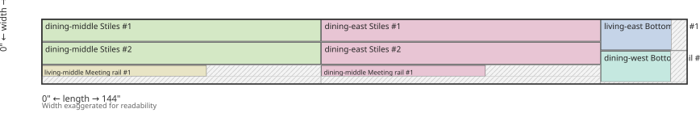

# Plan: Lumber Cut Optimizer

A Python tool that takes **stock lumber** and either a handwritten **cut list** or **window openings**, then outputs **which cuts to take from which board**.

This plan incorporates every decision from the original design plus later changes (storm windows, kerf, shop PDF, per-window cut tables, cross-cut-first / gang-rip sequence, cuts-from-openings, mixed-length packing, shorter rips on 12' and 10' boards, 1/8" glass class / fatter members, dining-side opening).

**Live base widths** in `examples/storm_window.yaml` are stile/top rail **2 1/8"** on the **smaller** opening in a 1/8" class (dining). Living pairs that are 1/8" wider get stiles **2 3/16"** so rail length (glass) matches (section 20). Formula tests still check 2 1/2" and 1 11/16" so the length math stays pinned. For whether this document is enough to rebuild the code, see section 19.

---

## 1. Problem definition

This is a **2D cutting-stock** problem on the **face** of each board, solved with a shop-realistic workflow: **rip to width, then cross-cut to length**.

| Axis | Meaning | Example |
|------|---------|---------|
| **Length** | Along the grain (primary cut direction) | 144" (12') |
| **Width** | Cross-grain (ripping) | 7 3/8" |
| **Thickness** | Fixed; omitted from input | 1" (4/4) |

Each stock piece is a rectangle **W × L**. Each cut needs **w × l**. Pieces are **not** rotated 90° (grain stays aligned with board length).

### Live example: seven storm windows

**Stock** (all 4/4, 1" thick) — `examples/storm_window.yaml` / `.json`:

| ID | Width | Length |
|----|-------|--------|
| board-a | 7 3/8 | 144 (12') |
| board-b | 7 | 144 (12') |
| board-c | 8 3/8 | 120 (10') |
| board-d | 7 1/4 | 120 (10') |
| board-e | 6 1/8 | 120 (10') |
| board-f | 4 3/4 | 97 1/2 (8' 1 1/2") |
| board-g | 4 7/8 | 97 (8' 1") |
| board-h | 5 1/2 | 97 (8' 1") |

**Openings** (sections 16 and 20) derive **35 pieces** from **seven** frames: dining west/middle/east/side + living west/middle/east. All **62 1/2" high**. Base stile/top rail **2 1/8"** (smaller width in a 1/8" class); living 21" / 42" stiles **2 3/16"** so rails match dining. dining-side is **40"** (own class, 2 1/8" stiles, 35 1/2" rails). Meeting rail **1 1/4"**, bottom rail **3 1/2"**.

**Result with the current packer:** all **35 pieces place**; **7 of 7** windows complete; waste about **34%** on used boards. Used: board-a through board-e (including wide 10' board-c). Unused leftover: board-f, board-g, board-h. 10' boards are through-cut (62 1/4" blank + 57 5/8" leftover), not a 10' rip.

### Historical fixture: three windows on three 8' boards

`examples/storm_window.craftsmanblog.yaml` keeps the original 2-small + 1-large list (1 11/16" stiles, 15 pieces). Under rip-then-crosscut that stock still places **14 of 15**; the 38 1/4" top rail is unplaced. Tests for shortage, gang-rip, and whole-board cross-cut-first use this file.

---

## 2. Confirmed design decisions

| Decision | Choice | Source |
|----------|--------|--------|
| Thickness | All stock and cuts are **1"**; thickness is not an input field | User |
| Cut workflow | Default: **rip to width**, then **cross-cut to length**. Same-length board → cross-cut first (section 14). Adjacent same-length-only strips → gang-rip (section 15). On **12' and 10' boards**, pack leftover length so a **through cross-cut** shortens the rip (section 18) | User |
| Grain rotation | **Not allowed** | Original plan default |
| Kerf | First-class input, default **1/8"**, overridable in the file and via `--kerf` | User question + original plan |
| Project type | **Storm windows** (stiles, top rail, meeting rail, bottom rail) | User correction (not door frames) |
| Window count | **Seven openings**: dining west/middle/east/side + living west/middle/east (sections 16, 20) | User |
| 1/8" glass class | Openings that differ by **1/8"** on an axis share inner size: extra frame goes into the two members (1/16" each) on the **larger** opening. `parts:` widths are the smaller opening. dining-side 40" is its own class | User |
| Expansion clearance | Subtract **1/4"** from opening height and width so the finished frame can swell | User |
| Frame joinery | Stiles run full height; rails sit **between** the stiles | User + original cut list |
| Shortage behavior | Place what fits; print **INSUFFICIENT STOCK** and list unplaced pieces; CLI exit code 1 | User |
| Input format | YAML or JSON problem file | Original plan (CSV deferred) |
| Inch math | `fractions.Fraction` (exact `4 3/4`, `1 11/16`) | Original plan |
| Optimizer | Two-stage greedy: pack strips **per stock length** (longest first), then widest-strip / tightest-width onto boards of that length (section 17) | User + mixed 12'/10'/8' stock |
| Objective | Maximize pieces placed, then tightest width fit (widest strips first) | Needed so wide rails claim width before stiles |
| 12' / 10' rips | Through-cut station blanks so rips are 62 1/4" (12': two stations + 19 1/4" leftover; 10': one station + 57 5/8" leftover). 8' stock stays rip-first / cross-cut-first / gang-rip | User |
| Shop report | **PDF** with instructions, per-board diagrams, **windows completed**, **unused stock**, and a **per-window cut table** (opening H×W plus each part’s L×W×qty; mixed numbers with `"` in one cell) | User |

---

## 3. Kerf

Kerf is consumed on every new cut, not treated as waste after the fact.

- **Rip cuts:** each additional strip on a board uses `width + kerf` of stock width (the first strip has no leading kerf).
- **Cross cuts:** each additional piece on a strip uses `length + kerf` of stock length (the first piece on a strip has no leading kerf).
- **Default:** `kerf: "1/8"` in the problem file.
- **Override:** `lumber optimize file.yaml --kerf 3/16`.
- **Waste %** includes kerf as consumed material, measured on **used boards only**: `(used stock area − placed area) / used stock area`. Unused leftover boards are listed, not counted as waste.
- **Feasibility:** three `1 11/16"` strips from a `5 1/2"` board require `3 × 1 11/16 + 2 × kerf ≤ 5 1/2`.

Same kerf is used for rip and cross-cut. No extra fudge factor.

---

## 4. Input format

One problem file (YAML or JSON). Thickness is implicit.

### Stock

| Field | Required | Meaning |
|-------|----------|---------|
| `width` | yes | Face width (cross-grain) |
| `length` | yes | Length along the grain |
| `id` | no | Label (defaults to `board-1`, `board-2`, …) |
| `quantity` | no | Identical boards (default `1`) |

### Cuts

| Field | Required | Meaning |
|-------|----------|---------|
| `name` | yes | Part label |
| `length` | yes | Finished length along the grain |
| `width` | yes | Finished width after ripping |
| `quantity` | no | How many of this part (default `1`) |

Sets of windows are usually **not** typed as `cuts`. Prefer `windows` + `parts` (section 16); the loader derives named pieces (`dining-west Stiles`, …). A handwritten `cuts:` list is still valid; do not put both `windows` and `cuts` in one file.

### Windows (optional; mutually exclusive with `cuts`)

| Field | Required | Meaning |
|-------|----------|---------|
| `expansion` | no | Clearance subtracted from opening height and width (default `1/4`) |
| `parts.stile.width` | yes if `windows` | Ripped stile width |
| `parts.top_rail.width` | yes if `windows` | Top rail width |
| `parts.meeting_rail.width` | yes if `windows` | Meeting rail width |
| `parts.bottom_rail.width` | yes if `windows` | Bottom rail width |
| `windows[].id` | no | Label (defaults to `window-1`, …) |
| `windows[].height` | yes | Opening height |
| `windows[].width` | yes | Opening width |
| `windows[].meeting` | no | Sill-to-meeting-rail height (glazing later; not used for lumber lengths) |

Dimensions are fractional inch strings (`4 3/4`, `1 11/16`, `1/8`). Decimals are accepted. Lengths in the file are **inches** (`144` for 12').

See `examples/storm_window.yaml` and `examples/storm_window.json`. The three-board handwritten list is `examples/storm_window.craftsmanblog.yaml`.

---

## 5. Optimization strategy

### Implemented: two-stage rip-then-crosscut packer

Matches how a table saw is used: rip strips, then cross-cut. On 12' and 10' stock the packer first **through-cuts** station blanks so those rips are not full-board length (section 18).

1. Expand stock and cuts by quantity (windows → cuts happen in `load_problem` before this).
2. For each distinct stock **length** (longest first), take remaining pieces that fit that length.
3. If `station_plan(board_length, longest_piece, kerf)` is set (10' and 12' with 62 1/4" stiles): pack **station blanks + remnant** (section 18). Physical boards that receive a station piece are then fully consumed so later length classes cannot pick them up.
4. Else (8' stock): group remaining pieces by **finished width**, pack strips to that board length (longest piece first, tightest strip remnant), then assign strips only to boards of that length (widest strip first, tightest remaining-width fit, kerf between rips).
5. Pieces that still have no board after every length class → **unplaced**.
6. Store a `BoardLayout` per used board (`layout.annotate_board_layouts`) so sequence and diagrams do not re-guess intent from rectangles.

This is Phase 1 of the original plan, specialized to guillotine rip strips (not free 2D nesting), then extended for mixed 12' / 10' / 8' stock (section 17) and through-cut stations (section 18).

**Why not longest-first 2D packing?** Placing all 62 1/4" stiles first can fill every stile-width slot and leave no width for wider bottom rails. Widest-strip-first avoids that.

**Why pack per board length?** Two 62 1/4" stiles plus kerf need 124 3/4". That fits a 12' board and does **not** fit a 10' board as a pair. Packing every strip against the longest board left 10' stock unused while stiles were reported unplaced. Length-class packing pairs stiles on 12' boards, then puts remaining stiles one-per-strip on 10' boards.

### Deferred (original plan Phase 2–3)

| Item | Status | Why deferred |
|------|--------|--------------|
| OR-Tools CP-SAT / MIP | Not started | Greedy places the live 35-piece list; 14/15 bound still holds for the 3-board fixture |
| Column generation | Not started | Same |
| CSV input | Not started | YAML/JSON covers the workflow |
| ASCII/SVG as a standalone format | Superseded | Replaced by the markdown report + board diagram (section 12) |
| Mixed thickness | Out of scope | All 1" |
| Separate rip vs cross-cut kerf | Not needed | One blade width is enough |
| Minimum offcut size / scrap inventory | Not started | Optional later |

---

## 6. Feasibility notes

### Live seven-window list (eight boards)

Under rip-then-crosscut with **per-length** strip packing, two 62 1/4" stiles still share a **12'** strip and not a **10'** pair (`124 3/4" > 120"`). Living stiles are **2 3/16"** (section 20); dining and dining-side stiles stay **2 1/8"**. dining-side adds 35 1/2" rails.

**Result: 35 of 35 pieces place; 7 of 7 windows complete; ~34% waste on used boards.** Unused leftover: board-f, board-g, board-h. 10' boards through-cut (section 18), including board-c.

### Historical three-window list (three 8' boards)

`examples/storm_window.craftsmanblog.yaml` — original 1 11/16" stiles:

- Two 62 1/4" stiles cannot share a 97 1/2" strip (`62 1/4 + 62 1/4 + kerf > 97 1/2`).
- A 62 1/4" stile cannot share a strip with a 38 1/4" rail (`62 1/4 + 38 1/4 + kerf > 97 1/2`).
- So **all 1 11/16" pieces** need **7 strips**: 6 exclusive stile strips + 1 exclusive large-top-rail strip (the two 17 1/4" top rails fit on stile remnants).
- Three boards can supply at most **7** strips of 1 11/16" **if every remaining width is used for those strips**.
- The 2 9/16" bottom rails need their own strip. That strip costs enough width that at most **6** strips of 1 11/16" remain.

**Result: 14 of 15 pieces place; the 38 1/4" × 1 11/16" top rail is unplaced.** The program reports that shortage.

The two small windows alone (10 pieces, no 38 1/4" rails) **all fit**.

Getting the 15th piece on that three-board pile would require a different shop workflow (cross-cut into length sections first, then rip each section). That is still out of scope **for recovering the 15th piece**. Using the same idea on **12' boards** so rips are not 12 feet long **is** requested (section 18).

---

## 7. Module layout

Environment: **uv** (`uv.lock`, `uv sync`). Python **3.11+**.

```
lumber/
├── pyproject.toml
├── uv.lock
├── .python-version          # 3.12
├── README.md
├── PLAN.md                 # this document
├── lumber/
│   ├── __init__.py
│   ├── __main__.py         # python -m lumber
│   ├── dimensions.py       # parse/format fractional inches
│   ├── models.py           # StockPiece, CutPiece, Placement, CutPlan, Problem,
│   │                       # WindowOpening, CutMode, StationPlan, BoardLayout
│   ├── io.py               # load YAML/JSON; windows vs cuts
│   ├── validate.py         # feasibility checks + quantity expansion
│   ├── layout.py           # station_plan, resolve/annotate BoardLayout
│   ├── packer.py           # per stock length; station blanks on 10'/12'
│   ├── sequence.py         # rip-first, cross-cut-first, gang-rip, through-cut
│   ├── windows.py          # openings → cuts; completion; PDF cut tables
│   ├── report.py           # text + JSON + markdown
│   ├── diagram.py          # board_regions + SVG; PDF reuses regions
│   ├── pdf.py              # PDF shop report
│   └── cli.py
├── examples/
│   ├── storm_window.yaml   # live: 6 openings, 8 boards, 2 1/8" stiles
│   ├── storm_window.json   # same as yaml
│   └── storm_window.craftsmanblog.yaml  # 3-window handwritten cuts
└── tests/
    ├── examples.py         # LIVE / CRAFTSMANBLOG paths
    ├── test_dimensions.py
    ├── test_validate.py
    ├── test_packer.py
    ├── test_storm_window.py
    ├── test_windows.py
    ├── test_diagram.py
    ├── test_sequence.py
    ├── test_pdf.py
    └── test_cli.py
```

**Runtime deps:** `pyyaml`, `reportlab`. Dev: `pytest`, `mypy`, `types-pyyaml`. Package script: `lumber = lumber.cli:main`.

**CLI format:** default `text`. If `-o` is set and `--format` is omitted, infer from suffix (`.pdf`, `.md`/`.markdown`, `.json`, `.txt`). Refuse writing a non-PDF format to a `.pdf` path. PDF requires `-o`. Markdown with `-o` also writes sibling SVGs named `{stem}-{stock-id}.svg`.

**CLI:**

```bash
uv run lumber optimize examples/storm_window.yaml
uv run lumber optimize examples/storm_window.json
uv run lumber optimize examples/storm_window.yaml --format json
uv run lumber optimize examples/storm_window.yaml --format markdown -o storm_window.md
uv run lumber optimize examples/storm_window.yaml --format pdf -o storm_window.pdf
uv run lumber optimize examples/storm_window.yaml --kerf 1/8 -o plan.txt
uv run python -m lumber optimize examples/storm_window.yaml
```

Exit code **0** if every piece is placed, **1** if any are unplaced or validation fails.

**Quantity expansion:** each cut with `quantity > 1` becomes that many pieces with `instance_id` `{name} #1`, `#2`, … (counter is per name). Stock with `quantity > 1` becomes `{id}-1`, `{id}-2`, …. `window_id` is copied onto every instance.

**BoardLayout** (`layout.py`), resolved after packing, in this order:

1. Empty board → rip-first
2. Every piece the same finished length → **cross-cut-first** (section 14), even if a station plan was recorded
3. Packer stored a `StationPlan` for that board → **through-cut** (section 18)
4. Else infer through-cut from geometry if `station_plan` fits and no piece straddles a cut
5. Else **rip-first**, with **gang-rip** on adjacent same-length-only strips (section 15)

---

## 8. Output

Human-readable cut list (primary):

```
LUMBER CUT PLAN
Kerf: 1/8"

Board: 144" x 7 3/8" x 1" (board-a)
  Sequence: through cross-cut (shorten long rips)
  Cross-cut @ 0" + 62 1/4" -> blank A
    ...
  Leftover blank: 19 1/4" x 7 3/8"
    Rip @ 0" -> 3 1/2" strip
    ...

Placed: 35 pieces
Board feet used: …
Waste: … bf (~34% on used boards)
Windows completed: 7 of 7
Complete: dining-east, dining-middle, dining-side, dining-west, living-east, living-middle, living-west
Unused stock: board-f (97 1/2" × 4 3/4" × 1"), board-g (97" × 4 7/8" × 1"), board-h (97" × 5 1/2" × 1")
```

When pieces do not fit (three-board fixture):

```
Placed: 14 pieces
INSUFFICIENT STOCK: 1 piece(s) could not be placed
UNPLACED:
  Top Rail #3: 38 1/4" x 1 11/16"
```

JSON includes placements, unplaced pieces, `placed` count, waste, and when openings were used: `windows_completed` / `windows_total` / complete and incomplete ids, plus `unused_stock`.

Markdown + sibling SVGs (section 12) exist as an optional format. The **shop-facing deliverable is a PDF** (section 13): one file with instructions, graphics, windows completed, unused stock, and a per-window cut table.

---

## 9. Test plan (coverage)

| Test | Status |
|------|--------|
| Dimension parser: `4 3/4` → `Fraction(19, 4)`; round-trip format | Done |
| 1D trivial: two lengths on one strip with kerf | Done |
| Kerf too large: second piece unplaced | Done |
| Kerf sensitivity: 1/8" vs 1/4" changes how many 1 11/16" strips fit in 5 1/2" | Done |
| No overlapping placements | Done |
| Rip kerf across width | Done |
| Validation: cut wider than stock | Done |
| Two small windows: all 10 pieces placed | Done |
| Three-board fixture: 14 placed, 38 1/4" top rail unplaced, `INSUFFICIENT STOCK` | Done |
| Live seven-window list: 35 placed, 7 of 7, glass-class stile widths, dining-side 35 1/2" rails | Done |
| Mixed stock lengths: leftover stiles pack onto shorter boards (not only the longest) | Done |
| CLI: text/json, `--kerf`, exit code 1 when short, exit 0 when complete | Done |
| Markdown report writes a `.md` with heading, summary, and unplaced list | Done |
| Each used board has a face diagram (pieces, kerf gaps, offcut) | Done |
| Diagram placements match packer coordinates (no overlap, in-bounds) | Done |
| PDF report writes a `.pdf` with summary, per-board diagram, and cut list | Done |
| PDF includes unplaced / INSUFFICIENT STOCK when stock is short | Done |
| PDF diagrams use the same `board_regions` geometry as the SVG | Done |
| Same-length board: instructions are cross-cut then rip (board-c stiles) | Done |
| Mixed-length board: instructions stay rip then cross-cut (craftsmanblog board-a) | Done |
| Adjacent same-length-only strips: gang-rip, cross-cut, then split (board-b stiles) | Done |
| Same-length leftover is one full-width offcut, not long narrow strips | Done |
| Derive cut list from window openings (height/width − 1/4", rails between stiles) | Done |
| PDF/text/markdown report how many windows are complete and which stock is unused | Done |
| PDF per-window cut table: opening H×W plus part L×W×qty; each measurement one cell with `"` (`62 1/2"`, not `62` \| `1/2`) | Done |
| PDF stock used list after window tables; assembled frames + two glass lites at the end (section 21) | Done |
| PDF unused-stock line: leftover board face size in parentheses after each id (section 23) | Done |
| Summary board feet used and waste in bf (2 decimals); stock dims largest-first then 1" (section 24) | Done |
| 12' boards: through cross-cut so rips are not full length; small parts in the leftover (section 18) | Done |
| 10' boards: one station + leftover (no 10' rip); unused leftover stock listed, not drawn | Done |
| OR-Tools golden comparison | Deferred with Phase 2 |

---

## 10. Implementation status

| Step | Task | Status |
|------|------|--------|
| 1 | `dimensions.py` + tests | Done |
| 2 | `models.py`, `io.py` | Done |
| 3 | `validate.py` | Done |
| 4 | Rip-then-crosscut packer (widest-first; per stock length) | Done |
| 5 | `report.py`, `cli.py`, `python -m lumber` | Done |
| 6 | Live example (7 windows, 8 boards) + 3-window craftsmanblog fixture | Done |
| 7 | Insufficient-stock reporting | Done |
| 8 | Kerf override + kerf tests | Done |
| 9 | OR-Tools packer | Deferred |
| 10 | Markdown shop report with per-board cut diagrams | Done |
| 11 | PDF shop report with instructions and cut graphics | Done |
| 12 | Cross-cut first when all pieces on a board share one length | Done |
| 13 | Gang-rip adjacent same-length strips, then cross-cut, then split | Done |
| 14 | Derive storm-window cuts from opening measurements (section 16) | Done |
| 15 | Pack strips per stock length so 10' / 8' boards get leftover stiles (section 17) | Done |
| 16 | Report windows completed and unused stock on the shop cutsheet | Done |
| 17 | 12' boards: pack small parts into leftover length; through cross-cut, then shorter rips (section 18) | Done |
| 18 | PDF per-window cut table (opening size + part list; mixed numbers with `"` in one cell) | Done |
| 19 | 10' boards: one 62 1/4" station + 57 5/8" leftover (no 10' rip); unused leftover stock listed, not drawn | Done |
| 20 | `layout.py`: shared `station_plan` / `BoardLayout` for packer, sequence, and diagrams | Done |
| 21 | 1/8" glass class: fatter members on the larger opening (section 20); dining-side 40" opening | Done |
| 22 | PDF stock used list, assembled frames, and glass sizes (section 21) | Done |
| 23 | PDF unused-stock line: dimensions in parentheses after each leftover board id (section 23) | Done |
| 24 | Stock dims largest-first, 1" last; summary board feet used and waste in bf (section 24) | Done |

---

## 11. Success criteria

- Loads the eight-board stock and **seven** openings from YAML or JSON and derives the **35**-piece cut list (section 20)
- Handwritten `cuts:` files still load (`storm_window.craftsmanblog.yaml`)
- Outputs an explicit **board → rip → cross-cut** sequence (through-cut, cross-cut-first, or gang-rip when those rules apply)
- Accounts for kerf on rips and cross-cuts
- Reports **board feet used**, waste in **bf** (2 decimals) plus percent, **windows completed**, and **unused stock** (leftover boards with size in parentheses; largest face dim first, 1" last)
- Places every piece that fits this workflow, and **lists what cannot be done** (14/15 on the three-board fixture)
- Two-window subset of the old list still places all 10 pieces
- Dining vs living 1/8" pairs share **rail length** (same glass width); living stiles are 1/16" fatter (section 20)
- dining-side (40") is its own width class: 2 1/8" stiles, 35 1/2" rails
- Live packing of 35 pieces / 7 windows on boards a–e (board-c used; leftover f, g, h)
- Can write a `.md` shop report that shows, for each used board, where every cut sits on the face
- Can write a single **PDF** with those instructions and graphics, suitable to print or open without a Markdown preview
- PDF lists each window’s opening and derived cuts (length, width, quantity) with mixed numbers and a `"` inch mark in a single cell per measurement
- PDF lists used stock dimensions after the window tables, then assembled frames and two glass lites per opening (section 21)
- When every piece on a board is the same length, shop instructions **cross-cut that length first**, then rip, so leftover is a full-width offcut
- When adjacent strips hold only same-length parts, **rip them as one blank**, cross-cut, then rip apart, so leftover is a wider offcut
- From opening height/width, compute stile and rail **lengths** (1/4" expansion; rails between stiles) and **widths** (section 20 glass class)
- On 12' and 10' boards, **do not rip the full board** when leftover length can hold the remaining parts: through cross-cut first, then rip the shorter blanks (section 18)

---

## 14. Cross-cut first when a board’s pieces share one length

**Status:** implemented. Packer assignments stay as they are. This changes **how we tell you to cut** a board (and how the diagram is drawn), not which pieces land on which board.

### Problem (board-c in the three-board fixture)

In `storm_window.craftsmanblog.yaml`, `board-c` is 5 1/2" × 97 1/2" and gets three 62 1/4" × 1 11/16" stiles. Rip-first would say:

1. Rip three full-length 1 11/16" strips (97 1/2" rips)
2. Cross-cut each strip at 62 1/4"

That leaves **long, narrow scrap**: three ~35" × 1 11/16" remnants, plus a skinny full-length leftover along the 5 1/2" width. Ripping 8-foot strips for parts that are all the same length is also the cumbersome/unsafe case discussed earlier.

### Rule

For each used board, look at the finished **length** of every placed piece:

- **All lengths equal** (e.g. three 62 1/4" stiles) → **cross-cut first**, then rip
- **Mixed lengths** (craftsmanblog board-a) → keep **rip first**, then cross-cut. Live 12' boards with a usable leftover use section 18.
- **Mixed board with a same-length-only pair of strips** (board-b stiles) → section 15, not whole-board cross-cut first

“Same length” means the same finished part length. Kerf is not a part length.

### Shop sequence (same-length board)

Example, board-c, all parts 62 1/4":

1. **Cross-cut** the full 5 1/2" width at 62 1/4" (one through-cut; kerf after that cut)
2. **Rip** the 62 1/4" × 5 1/2" blank into the stile widths (1 11/16" + kerf + 1 11/16" + kerf + 1 11/16")
3. Leftover is **one** ~35 1/8" × 5 1/2" offcut (full width, shorter) — usable, not three skinny sticks

If several same-length pieces fit **end-to-end** on the board (e.g. all 17 1/4"), make one through cross-cut per station along the length (`length + kerf` between stations), then rip each blank.

### What does not change

- Which pieces the packer assigns to which board
- Mixed-length boards (still rip full-length strips, then cross-cut)
- The general “always cross-cut first on every board” idea (still out of scope for mixed 62 1/4" + 38 1/4" sharing one length). **12' leftover + small parts** is section 18.

### Reports (text, Markdown, PDF)

Same-length boards should read:

```
Board: 5 1/2" x 1" x 97 1/2" (board-c)
  Sequence: cross-cut first (all parts 62 1/4")
  Cross-cut @ 0" + 62 1/4" -> blank A
    Rip @ 0" -> 1 11/16" -> Stiles #4
    Rip @ 1 13/16" -> 1 11/16" -> Stiles #5
    Rip @ 3 5/8" -> 1 11/16" -> Stiles #6
  Offcut: 35 1/8" x 5 1/2" (full width)
```

The face diagram should show the **through cross-cut** and rips on the short blank, with leftover as a full-width rectangle — not three long rip strips.

### Implementation notes

- Helper: `shared_length(placements) -> Fraction | None` in `sequence.py`
- Instruction builder and diagrams branch on that (text, markdown, PDF)
- Tests: three equal-length stiles emit “cross-cut first”; mixed-length board-a in the fixture still “rip first”; leftover width equals stock width

On the **live** eight-board list, 10' boards that hold a stile plus remnant rails are **through-cut** (section 18), not whole-board cross-cut-first. Cross-cut-first still applies to same-length 8' boards (craftsmanblog board-c).

### Out of scope for this item

- Rewriting the packer to *prefer* grouping same-length pieces onto one board (nice later; not required for board-c today)
- Cross-cut-first on mixed-length boards (see section 18 for 12' leftover blanks)
- Changing kerf math for mixed-length rip-first boards

---

## 12. Markdown shop report with board diagrams

**Status:** implemented. This replaces the old “optional ASCII/SVG layout” item.

The program will write a **Markdown file** (e.g. `storm_window.md`) that a person can open in any editor or Git viewer and take to the saw. It is not a substitute for the packer — it only renders an already-computed `CutPlan`.

### Why Markdown

- One file: summary, cut list, and pictures together
- Renders in GitHub, Cursor, and most editors
- Easy to archive next to `examples/storm_window.yaml`

### CLI

```bash
uv run lumber optimize examples/storm_window.yaml --format markdown -o storm_window.md
```

- `--format markdown` (aliases: `md`) produces the report
- `-o` / `--output` writes the `.md` (if omitted, print to stdout)
- Text and JSON formats stay as they are

### File shape

```markdown
# Lumber cut plan

Kerf: 1/8"
Placed: 35 pieces
Board feet used: …
Waste: … bf (~34%)
Windows completed: 7 of 7
Complete: dining-east, dining-middle, dining-side, dining-west, living-east, living-middle, living-west
Unused stock: board-f (97 1/2" × 4 3/4" × 1"), board-g (97" × 4 7/8" × 1"), board-h (97" × 5 1/2" × 1")

## board-a — 144" × 7 3/8" × 1"



### Cuts
- Sequence: through cross-cut (shorten long rips)
- Cross-cut @ 0" + 62 1/4" -> blank A
  - Rip @ 0" → 2 1/8" → dining-middle Stiles #1
  - ...
```

When pieces do not fit, an **Unplaced** / `INSUFFICIENT STOCK` section is appended (three-board fixture). Used boards are drawn; unused boards appear only in the summary line.

### Diagram (one per used board)

Face view of the board, **to scale**:

- Horizontal: **length** (grain), left → right
- Vertical: **width** (rips), **first rip strip at the top** (`rip_offset` increases downward in SVG user units; PDF flips y for PDF coordinates)

Each placed piece is a labeled rectangle at its `rip_offset` / `length_offset` with its finished `width` × `length`. Show:

- Part name and instance (`Stiles #1`)
- Finished size (`62 1/4" × 1 11/16"`)
- **Kerf** as a thin gap between strips and between cross-cuts (not labeled as a part)
- **Offcut / waste** as an unlabeled remainder so leftover length and leftover width are visible
- Board outline with overall width and length

**Format for v1:** one sibling `.svg` per used board, referenced from the Markdown with ``. Markdown previews (including Cursor) strip raw `<svg>` tags, so the graphic only shows when it is a linked image file. Open the `.md` in preview, not as raw source.

**Not for v1:** interactive HTML or a second packing algorithm. The diagram draws the **current** layout (rip-first, cross-cut-first, gang-rip, or through-cut).

### Implementation notes

- Add `lumber/diagram.py` to turn one board’s placements + stock size + kerf into an SVG string
- Add `format_markdown(plan)` and `write_markdown_report(plan, path)` in `report.py` (writes the `.md` and sibling `.svg` files)
- Scale: map inches to SVG user units (e.g. 1" = 8 px) with a max width so an 8-foot board fits on a page
- Tests: markdown contains `# Lumber cut plan`, one `##` heading per used board, `INSUFFICIENT STOCK` when unplaced; SVG rectangles match placement coordinates and stay inside the board

### Out of scope for this item

- Changing the packer to cross-cut-first (discussed separately; would change the diagram geometry)
- OR-Tools / CSV input

---

## 13. PDF shop report

**Status:** implemented. This is the **primary shop output**. Markdown/SVG (section 12) stays as an optional format; it failed as a take-to-the-saw document because Cursor/GitHub previews strip or hide inline SVG.

### Goal

One file, e.g. `storm_window.pdf`, that contains:

1. Title, kerf, placed count, **board feet used**, waste in **bf** (2 decimals), **windows completed** (when cuts have window ids), **unused stock** with leftover board size in parentheses (largest face dim first, 1" last; sections 23–24)
2. **Cuts by window** (when openings were used): one table per window, two-up on the page
3. **Stock used**: each board that received cuts, with largest face dimension first and **1" last** (YAML stock order). Handwritten jobs get this after the summary.
4. For each used board: a **drawn face diagram** (same geometry as today’s SVG) and the rip / cross-cut list
5. An **Unplaced** section with `INSUFFICIENT STOCK` when pieces do not fit
6. **Assembled frames** (when openings were used): one face drawing per window plus the two glass lites (section 21)

Open in any PDF viewer, print, or take to the shop. No Markdown preview required.

### CLI

```bash
uv run lumber optimize examples/storm_window.yaml --format pdf -o storm_window.pdf
```

- `--format pdf` produces the PDF
- `-o` / `--output` is **required** for PDF (binary; do not dump to the terminal)
- Text, JSON, and markdown formats stay as they are

### Page layout (US Letter, portrait)

```
Lumber cut plan
Kerf: 1/8"
Placed: 35 pieces
Board feet used: …
Waste: … bf (~34%)
Windows completed: 7 of 7
Complete: dining-east, dining-middle, dining-side, dining-west, living-east, living-middle, living-west
Unused stock: board-f (97 1/2" × 4 3/4" × 1"), board-g (97" × 4 7/8" × 1"), board-h (97" × 5 1/2" × 1")

Cuts by window
  dining-west          dining-middle
  Height  62 1/2"           Height  62 1/2"
  Width   20 7/8"           Width   41 7/8"
  Stiles  62 1/4"  2 1/8"  2
  Top Rail 16 3/8"  2 1/8"  1
  …

Stock used
  board-a  144" × 7 3/8" × 1"
  board-b  144" × 7" × 1"
  …

board-a — 144" × 7 3/8" × 1"
[ diagram ]
Cuts
  Sequence: through cross-cut (shorten long rips)
    …

board-d — 120" × 7 1/4" × 1"
  Sequence: through cross-cut (shorten long rips)
  Leftover blank: 57 5/8" x 7 1/4"
  …

Assembled frames
  Rabbet 1/4" wide × 3/8" deep; glass 1/8" DS, 1/16" per side
  dining-west          dining-middle
  [ face drawing ]     [ face drawing ]
  Outer 20 5/8" × 62 1/4"
  Upper glass 16 3/4" × 28 1/2"
  Lower glass 16 3/4" × 27 5/8"
```

- One board per page when the diagram + cut list would overflow; otherwise pack multiple boards on a page if they fit
- Unused boards are listed in the summary, not drawn
- Diagram rules unchanged from section 12 (labels, kerf gaps, hatched offcut, optional “width exaggerated” note)

### Cuts by window

When the problem was loaded from `windows:` (cuts carry `window_id`), the PDF inserts a **Cuts by window** block after the summary and before **Stock used**. Handwritten `cuts:` files skip the window tables and assembled frames; they still list **Stock used**.

Each window is a small grid:

| Column | Opening rows | Part rows |
|--------|----------------|-----------|
| 1 | Height / Width | Stiles, Top Rail, Meeting rail, Bottom rail |
| 2 | Opening size (`62 1/2"`) | Part **length** (`62 1/4"`) |
| 3 | — | Part **width** (`2 1/8"`) |
| 4 | — | **Quantity** |

Do **not** split a mixed number across two cells (`62` | `1/2`). Whole number and fraction share one cell, same as `format_inches`, with a `"` suffix. No separate “inches” column.

Leave a gap between the window-id heading and the first grid row so descenders (`g` in dining, `g` in living) are not clipped by the cell fill.

Dining west (live **2 1/8"** stiles) is the worked example: opening 62 1/2 × 20 7/8; stiles 62 1/4 × 2 1/8 × 2; rails 16 3/8 (top 2 1/8, meeting 1 1/4, bottom 3 1/2). Those lengths come from section 16, not from packing. Formula tests still use 2 1/2" stiles → dining-west rails 15 5/8".

Openings are stored on `Problem` / `CutPlan` so the table can print original height and width, not only the derived pieces.

### Library

Use **ReportLab** (`reportlab` via `uv add reportlab`):

- Works on Windows without GTK/Cairo (WeasyPrint does not)
- Draws the board from `board_regions()` — same inches as the SVG, not a screenshot of HTML
- Writes text instructions in the same file

Do **not** shell out to a browser or require a system PDF printer.

### Implementation notes

- Add `lumber/pdf.py` with `write_pdf(plan, path)`
- Reuse `lumber.diagram.board_regions` for piece / kerf / waste rectangles; map inches to page points with a max diagram width (~7.5" on letter)
- CLI: `--format pdf`; error if `-o` is missing
- `uv add reportlab` (runtime dependency, not only dev)
- Tests: writing a PDF creates a file that starts with `%PDF`; the 3-window fixture PDF contains board ids and `INSUFFICIENT STOCK`; after section 20 the live PDF contains `Windows completed: 7 of 7`, dining-side, unused stock, `Cuts by window`, dining-west, `16 3/8"` / `2 1/8"` / `2 3/16"`; after section 21 it also contains `Stock used`, board-a dimensions, `Assembled frames`, dining-west glass `16 3/4"` / `27 5/8"` / `28 1/2"`; handwritten-cut PDFs omit the window tables and assembled frames but list Stock used; `window_cut_tables` is file order (seven openings)

### Out of scope for this item

- Form-fillable PDFs, CNC toolpaths, or a second packing algorithm
- Changing the packer to cross-cut-first
- Replacing text/JSON/markdown (they remain)

---

## 15. Gang-rip adjacent same-length strips

**Status:** implemented. Packer assignments stay as they are. This is the board-b counterpart to section 14: the **whole board** is mixed length, but **two adjacent strips** are the same length only.

### Problem (board-b in the three-board fixture)

In `storm_window.craftsmanblog.yaml`, `board-b` is 4 7/8" × 97 1/2". Rip-first would say:

1. Rip a 1 11/16" strip the full 97 1/2" → cross-cut Stiles #2 at 62 1/4"
2. Rip another 1 11/16" strip the full 97 1/2" → cross-cut Stiles #3 at 62 1/4"
3. Rip the remaining 1 1/4" for meeting rails (38 1/4" + 17 1/4" + 17 1/4")

Stiles #2 and #3 are the **same length**, but we rip them **apart** for the full 8 feet first. After the 62 1/4" cross-cuts you get two **skinny** leftovers: about 35" × 1 11/16" each. That scrap is too narrow to be useful. The meeting-rail strip is a different length mix, so we cannot cross-cut the entire board first (section 14 does not apply).

### Intended sequence

Treat the two stile strips as **one blank** until after the length cut:

1. **Rip once** to the **combined width** of Stiles #2 + kerf + Stiles #3  
   `1 11/16 + 1/8 + 1 11/16 = 3 1/2"`  
   Do **not** split the two stiles yet.
2. **Cross-cut** that 3 1/2" strip at 62 1/4" (kerf between blank and leftover).
3. **Rip apart** the 62 1/4" × 3 1/2" blank into Stiles #2 and Stiles #3.
4. Rip the remaining 1 1/4" of board width as today for the meeting rails.

Leftover from the stile pair is **one** ~35 1/8" × **3 1/2"** offcut — wide enough to reuse — instead of two 1 11/16" sticks.

### Rule

On a board that is **not** all one length (section 14 already handled those):

- Group adjacent rip strips whose pieces are **all the same finished length** and that strip has **no other lengths** on it (a “same-length-only” strip).
- If two or more such strips sit next to each other and share that length, **gang** them:
  - Rip the group as one strip (sum of widths + kerfs between them)
  - Cross-cut to that length
  - Then rip the short blank into the individual parts
- Any leftover length of that gang strip is one offcut of the **combined width**
- Other strips on the same board (meeting rails on board-b) stay rip-then-cross-cut

Stiles #1 on board-a does **not** gang: that 1 11/16" strip also holds 17 1/4" top rails, so it is not same-length-only.

### Shop wording (board-b)

```
Board: 4 7/8" x 1" x 97 1/2" (board-b)
  Sequence: gang-rip Stiles #2 and #3 (same length 62 1/4")
  Rip @ 0" -> 3 1/2" pair strip
    Cross-cut @ 0" + 62 1/4" -> pair blank
      Rip @ 0" -> 1 11/16" -> Stiles #2
      Rip @ 1 13/16" -> 1 11/16" -> Stiles #3
    Offcut: 35 1/8" x 3 1/2"
  Rip @ 3 5/8" -> 1 1/4" strip
    Cross-cut @ 0" + 38 1/4" -> Meeting rail #3
    ...
```

The diagram should show the pair as one 3 1/2" band through 62 1/4", then the split on the short blank, with leftover **3 1/2" wide** (not two 1 11/16" remnants). Meeting-rail strip unchanged.

### What does not change

- Which pieces the packer assigns to which board
- Section 14 whole-board cross-cut-first (board-c)
- Mixed strips that already use remnant length for other parts (board-a stile + top rails)
- Meeting-rail sequence on board-b

### Implementation notes

- `sequence.iter_strip_runs` clusters adjacent same-length-only strips
- Instruction builder: gang cluster → rip combined → cross-cut → split; remaining strips as today
- Diagram leftover for a gang uses combined width after the through length cut
- Tests: board-b emits gang-rip / 3 1/2" pair / 3 1/2" offcut; board-a has no gang-rip; board-c still whole-board cross-cut first

### Out of scope for this item

- Rewriting the packer to create more gang-able pairs
- Ganging strips that are not adjacent
- Ganging strips that have mixed lengths on them

---

## 16. Storm window cuts from opening measurements

**Status:** implemented. Glass-class member widths are section 20. The packer still consumes a flat cut list; `load_problem` writes that list from openings plus per-window stile/rail widths.

Cuts are named with the window id (`dining-west Stiles`). `CutPiece.window_id` is preserved through expand/pack so the shop report can count complete frames.

### Openings (from the house)

All **seven** frames are **62 1/2" high**. Dining west/east match each other; living west/east match each other; those two pairs differ by **1/8"** in width (glass class, section 20). Dining middle and living middle likewise. **dining-side** (dining room side window) is **40"** — not 1/8" from 41 7/8" or 42", so it is its own class.

| Window | Height | Width | Meeting (sill to meeting rail) |
|--------|--------|-------|--------------------------------|
| Dining west | 62 1/2 | 20 7/8 | 31 1/2 |
| Dining middle | 62 1/2 | 41 7/8 | 31 1/2 |
| Dining east | 62 1/2 | 20 7/8 | 31 1/2 |
| Dining side | 62 1/2 | 40 | 32 3/4 |
| Living west | 62 1/2 | 21 | 32 |
| Living middle | 62 1/2 | 42 | 32 |
| Living east | 62 1/2 | 21 | 32 |

**Meeting height** is where the meeting rail sits in the opening. It does **not** change lumber piece lengths. Keep it on the window record for later glass/glazing. Each window still gets one meeting-rail **piece**, same length as that window’s top and bottom rails.

### Part widths

Ripped widths in `examples/storm_window.yaml` / `.json`:

| Part | Base width (`parts:`) | Per window | Notes |
|------|------------------------|------------|--------|
| Stile | **2 1/8"** | 2 | Living 21" / 42" stiles **2 3/16"** (section 20) |
| Top rail | **2 1/8"** | 1 | +1/16" only if height class (none live) |
| Meeting rail | 1 1/4 | 1 | Width never fattened for 1/8" class |
| Bottom rail | 3 1/2 | 1 | +1/16" only if height class (none live) |

Historical fixtures: 2 1/2" / 1 11/16" stile lists still used in formula tests.

Seven windows → **14 stiles + 21 rails = 35 pieces**. Cut names: `{window-id} Stiles` / `Top Rail` / `Meeting rail` / `Bottom rail`. Each expanded instance is `{name} #n`. YAML id for the side window is `dining-side`.

### Assembly and expansion

Stiles are the full height of the frame. Rails sit **between** the stiles (butt join). Finished frame must be **1/4" under** the opening on both axes so the wood can expand:

```
stile_length = opening_height − 1/4"
rail_length  = opening_width  − 1/4" − 2 × stile_width
```

Check against the original 1 11/16" stile list: dining west `20 7/8 − 1/4 − 2 × 1 11/16 = 17 1/4"`, dining middle `41 7/8 − 1/4 − 2 × 1 11/16 = 38 1/4"`, stile `62 1/2 − 1/4 = 62 1/4"`. That is how the first cut list was built. Wider stiles make the rails shorter; the opening and the 1/4" clearance stay the same.

If rails were cut to `opening_width − 1/4"` (full frame width), the assembled frame would be two stile-widths **wider** than the opening and would not fit. So rail length is **not** simply width minus 1/4".

### Worked cut list

`stile_length = 62 1/2 − 1/4 = 62 1/4"` for every window (all the same height).

**Base 2 1/8" stiles** (smaller width in the class): `rail_length = width − 4 1/2"` because `1/4 + 2 × 2 1/8 = 4 1/2`.

**Living 1/8" wider:** stiles **2 3/16"**; rails match dining (`1/4 + 2 × 2 3/16 = 4 5/8"`, so `21 − 4 5/8 = 16 3/8"`).

| Group | Windows | Stile L × W | Rail L | Top | Meeting 1 1/4 | Bottom 3 1/2 |
|-------|---------|-------------|--------|-----|---------------|--------------|
| Dining W+E | 2 | 62 1/4 × 2 1/8 (4) | 16 3/8 | 2 1/8 | 2 | 2 |
| Living W+E | 2 | 62 1/4 × 2 3/16 (4) | 16 3/8 | 2 1/8 | 2 | 2 |
| Dining middle | 1 | 62 1/4 × 2 1/8 (2) | 37 3/8 | 2 1/8 | 1 | 1 |
| Living middle | 1 | 62 1/4 × 2 3/16 (2) | 37 3/8 | 2 1/8 | 1 | 1 |
| Dining side | 1 | 62 1/4 × 2 1/8 (2) | 35 1/2 | 2 1/8 | 1 | 1 |

Stiles: **10** @ 2 1/8" + **6** @ 2 3/16" (all 62 1/4" long).

Finished frame check, dining west: `2 × 2 1/8 + 16 3/8 = 20 5/8"` = `20 7/8 − 1/4`. Living west: `2 × 2 3/16 + 16 3/8 = 21 3/4"` = `21 − 1/4`. dining-side: `2 × 2 1/8 + 35 1/2 = 39 3/4"` = `40 − 1/4`.

**Formula tests (2 1/2" stiles, no glass class)** still pin dining west rails at 15 5/8" and living middle at 36 3/4". That is not the live YAML.

### Input shape

Keep stock in the same YAML/JSON. Add openings plus part widths, and **derive** `cuts` instead of typing them. Do not list both `windows` and `cuts` in one file.

```yaml
expansion: "1/4"
parts:
  stile: { width: "2 1/8" }
  top_rail: { width: "2 1/8" }
  meeting_rail: { width: "1 1/4" }
  bottom_rail: { width: "3 1/2" }
windows:
  - id: dining-west
    height: "62 1/2"
    width: "20 7/8"
    meeting: "31 1/2"
```

`load_problem` expands windows → cut pieces named with the window id (`dining-west Stiles`, …), then `optimize` packs as today. A handwritten `cuts:` list remains valid for tests and one-off jobs (`examples/storm_window.craftsmanblog.yaml`).

### Implementation notes

- `lumber/windows.py`: `stile_length`, `rail_length`, `cuts_from_windows`, `member_widths_for_windows`
- Live example: `examples/storm_window.yaml` and `.json` (seven openings, eight boards)
- Tests: formula dining west 15 5/8" rails with 2 1/2" stiles; live dining west 16 3/8" with 2 1/8"; living west rails **equal** dining west; living stiles 2 3/16"; dining-side 35 1/2"; 35 pieces; original 1 11/16" stiles still yield 17 1/4" / 38 1/4"; handwritten cut list still loads

### Live packing result

With the eight-board stock, per-length packing (section 17), 10'/12' through-cuts (section 18), and glass-class widths (section 20): **35 of 35 placed**, **7 of 7 windows complete**, ~34% waste on used boards. Unused leftover: board-f, board-g, board-h. board-c is used.

Shop reports print:

```
Windows completed: 7 of 7
Complete: dining-east, dining-middle, dining-side, dining-west, living-east, living-middle, living-west
Unused stock: board-f (97 1/2" × 4 3/4" × 1"), board-g (97" × 4 7/8" × 1"), board-h (97" × 5 1/2" × 1")
```

The **PDF** also prints **Cuts by window** (section 13) in file order (includes dining-side).

### What does not change

- Kerf, shop sequence rules, diagrams
- 4/4 (1") thickness
- Handwritten `cuts:` files for tests and one-off jobs

### Out of scope for this item

- Mortise-and-tenon extra length on rails
- Fattening meeting-rail **width** for a 1/8" class (stiles for width; top/bottom rails for height)

Stile/rail **width** by opening class is section 20, not this item.

### Tests

- Dining west rail length is `15 5/8"` with 2 1/2" stiles (formula fixture); live YAML dining west rails are `16 3/8"` at 2 1/8"; stile length `62 1/4"`
- Living west/east rails match dining west (`16 3/8"`) with 2 3/16" stiles; middles both `37 3/8"`; dining-side rails `35 1/2"`
- Seven windows produce 35 pieces
- Reverse of the original 1 11/16" widths still yields 17 1/4" / 38 1/4" dining rails
- Existing handwritten cut-list problems still load
- Live example: 35 pieces, 7 of 7 windows complete (after section 20); PDF contains `Windows completed` and dining-side

---

## 17. Mixed-length stock packing and leftover boards

**Status:** implemented.

### Problem

The first packer packed every strip against the **longest** stock board. With 12' and 10' lumber in the same pile:

- Two 62 1/4" stiles + kerf = 124 3/4" → fits 144", does not fit 120" as a pair
- Those two-stile strips were assigned only to 12' boards; leftover pairs were marked unplaced
- 10' boards (c, d, e) sat unused even though each can take **one** 62 1/4" stile per 2 1/2" strip

### Rule

1. Sort distinct stock lengths longest-first (144", then 120", then 97 1/2", then 97").
2. Pack remaining pieces into strips that fit **that** length.
3. Assign those strips only to boards of **that** length (widest strip first, tightest leftover width).
4. Unassigned pieces go to the next shorter length class.

So 12' boards get paired stiles; leftover stiles become one-per-strip on 10' boards. 8' leftovers (board-f/g/h) stay unused if everything already placed.

### Shop report

Used boards are drawn as before. Boards with no placements are **not** drawn; they are listed:

```
Unused stock: board-f (97 1/2" × 4 3/4" × 1"), board-g (97" × 4 7/8" × 1"), board-h (97" × 5 1/2" × 1")
```

### Tests

- Four 62 1/4" × 2 1/2" stiles: two on a 2 1/2" × 144" board, two on a 5 1/8" × 120" board; none unplaced
- Live storm-window optimize uses board-c, board-d, and board-e (10' through-cut); leftover is board-f, g, h
- Three-board craftsmanblog fixture still 14/15 (same-length 8' stock; behavior unchanged)

---

## 18. Shorten 12' and 10' rips: leftover length, then through cross-cut

**Status:** implemented. The packer treats a long board as one or more 62 1/4" station blanks plus a **full-width leftover**.

| Stock | Stations | Leftover | Shop rips |
|-------|----------|----------|-----------|
| 12' (144") | two × 62 1/4" | 19 1/4" | not 12' |
| 10' (120") | one × 62 1/4" | 57 5/8" | not 10' |
| 8' (~97") | none (count would be 1 but leftover packing loses the 8' fixture) | — | rip-first / cross-cut-first / gang-rip |

Small parts (`length ≤ leftover`) go in the leftover; longer rails share the station blanks. Shop instructions and the face diagram are through-cut.

### Problem (before)

`board-a` is 7 3/8" × 144". The old layout hung short rails on the **end of a full-length 12' rip**. `board-e` (6 1/8" × 120") was a **10' rip**: a 62 1/4" stile, a 37 1/2" rail, and a 16 1/2" rail on one strip, plus a second strip that used only 16 3/8" of 10'. Waste on used boards was **~45%**, and the wide 10' board-c was almost empty except skinny meeting-rail strips.

### Geometry

12': two stations + kerf after each:

```
62 1/4 + 1/8 + 62 1/4 + 1/8 = 124 3/4"  (leftover starts here)
144 − 124 3/4 = 19 1/4"
```

10': one station (two 62 1/4" stiles do not fit 120"):

```
62 1/4 + 1/8 = 62 3/8"  (leftover starts here)
120 − 62 3/8 = 57 5/8"
```

A 37 1/2" living-middle rail **fits the 10' leftover** and does not need a 10' rip. Remnants are only used on boards that already received a station piece, so leftover 10' stock is not opened just for skinny strips.

### Live sequence (board-e)

```
Board: 6 1/8" x 1" x 120" (board-e)
  Sequence: through cross-cut (shorten long rips)
  Cross-cut @ 0" + 62 1/4" -> blank A
    Rip 2 1/8" -> living-middle stiles
  Leftover blank: 57 5/8" x 6 1/8"
    Rip 3 1/2" / 2 1/8" -> remaining rails
```

board-d is the same 10' pattern. After section 20, board-c (8 3/8" × 10') is **used** the same way (station + remnant). The craftsmanblog 8' fixture is unchanged (14/15, gang-rip on board-b).

### Rule

On a board **10' or longer** that fits at least one of the longest piece:

- Pack long pieces onto the station blanks.
- Pack pieces with `length ≤ leftover` into the leftover blank of boards that already have station parts.
- Overflow small pieces onto remaining station width of those boards, then the next length class.
- Shop instructions: **through cross-cut**, then rip the shorter blanks.
- 8' stock does not use this path (`station_plan` returns None when count == 1 and length < 120").

`station_plan(board_length, station, kerf)`: fit as many `station` blanks as will fit with kerf **after each** blank (including the last). Remnant starts at `used + kerf`. Reject count 0, reject `count == 1` when `board_length < 120"` (so 8' stays rip/cross-cut/gang), reject a non-positive remnant.

Station pack order: (1) long parts onto station blanks, (2) short parts onto remnants of boards that already have a station piece, (3) leftover short parts onto remaining station width of those same boards. Do not open a leftover 10' board just for skinny remnant strips.

### What does not change

- Seven windows still complete from current stock (35/35)
- Kerf, expansion
- Sections 14–15 on 8' boards that are already all one length or gang-rippable
- Recovering the 15th piece on the three 8' boards (still out of scope)

### Tests

- board-a (live): through cross-cut / 19 1/4" leftover
- board-d and board-e: through cross-cut / 57 5/8" leftover; remnant parts fit that leftover
- board-c used (through-cut); leftover board-f, g, h; waste on used boards ~34%
- 8' `station_plan` still None; craftsmanblog still 14/15

---

## 20. Uniform glass class for 1/8" opening pairs

**Status:** implemented. The rabbetted lip (glass rebate) is the **same** for openings that differ by only 1/8". That 1/8" of finished frame goes into the wood, not into a second glass size.

Teaching example: 21 7/8" vs 22" wide — the **wider** window’s stiles are each **1/16" fatter** (1/8" total), so **rail length matches**. Live openings stay 20 7/8"/21" and 41 7/8"/42"; the same 1/16" split applies. dining-side (40") is **not** in those classes.

### Rule

When two openings differ by **1/8"** on an axis, that 1/8" of finished frame (`opening − expansion`) is absorbed in the **two members on that axis** (1/16" each) on the **larger** opening. Extra wood is on the **outer** edge; rabbet depth is unchanged and is **not** a YAML field. `parts:` widths are the **smaller** opening in the class.

- **Width +1/8":** each stile of the wider window is `parts.stile + 1/16"`. Rail **length** equals the narrower window. Meeting-rail **width** is unchanged.
- **Height +1/8":** top and bottom rails of the taller window are each `parts.* + 1/16"`. Meeting-rail width unchanged. Stile **length** is still `height − expansion` (already 1/8" longer). Live heights are all 62 1/2" — no height split yet.
- **Classes:** connected groups whose widths (or heights) differ by **0 or exactly 1/8"**. Other gaps are separate classes (base `parts:` widths).

Live width classes:

| Class | Openings | Stile width | Common rail length |
|-------|----------|-------------|--------------------|
| Narrow | dining-west, dining-east (20 7/8"); living-west, living-east (21") | 2 1/8" dining; **2 3/16"** living | 16 3/8" |
| Wide | dining-middle (41 7/8"); living-middle (42") | 2 1/8" dining; **2 3/16"** living | 37 3/8" |
| Side | dining-side (40") | 2 1/8" | 35 1/2" |

`40"` vs `41 7/8"` is 1 7/8"; vs `42"` is 2". dining-side does not join the middle class.

Worked checks (expansion 1/4"):

```
dining W/E:  20 7/8 − 1/4 − 2 × 2 1/8  = 16 3/8"
living W/E:  21     − 1/4 − 2 × 2 3/16 = 16 3/8"
dining mid:  41 7/8 − 1/4 − 2 × 2 1/8  = 37 3/8"
living mid:  42     − 1/4 − 2 × 2 3/16 = 37 3/8"
dining-side: 40     − 1/4 − 2 × 2 1/8  = 35 1/2"
```

### dining-side

Add to `examples/storm_window.yaml` / `.json` with the dining group (after dining-east is fine):

```yaml
  - id: dining-side
    height: "62 1/2"
    width: "40"
    meeting: "32 3/4"
```

Meeting 32 3/4" is stored for glazing; it does not change lumber. Seven windows → **35 pieces**. PDF “Cuts by window” includes this table. Completeness **7 of 7**. Live packing uses board-c; leftover is board-f, g, h.

### Implementation notes

- After parsing all `windows:`, cluster by width and by height (edge if difference is 0 or 1/8").
- Per window: stile width = `parts.stile` if width is the class minimum, else `parts.stile + 1/16"` when the class range is 1/8". Same for top/bottom rail vs height. Meeting rail width always `parts.meeting_rail`.
- `cuts_for_window` uses that window’s stile width in `rail_length` and on the stile `CutPiece`s.
- Tests: living west rails = dining west; living stiles 2 3/16"; both middles 37 3/8"; dining-side 35 1/2" and 5 pieces; 35 expanded cuts; PDF lists dining-side; packing assertions updated from the run.
- Do not change handwritten `cuts:` files. Base YAML `parts.stile` stays `2 1/8"`.

### What does not change

- Expansion 1/4", kerf, joinery (rails between stiles)
- Meeting height still unused for lumber
- 8' craftsmanblog fixture
- Through-cut station geometry (section 18)

### Out of scope

- Auto-classing gaps other than 1/8" (e.g. 1/4")
- Rabbet depth as an input
- Changing glass / meeting-rail **length** independently of rail_length

---

## 21. PDF stock used, assembled frames, and glass

**Status:** implemented. PDF-only. Packing and YAML schema are unchanged. Rabbet is a fixed **1/4" wide × 3/8" deep** (face overlap × depth into the 1" thickness), not a YAML field. Glass is **1/8" double-strength**, undersize **1/16" per side** in the rabbet so it can expand. The meeting rail has a rabbet on **both** faces so it holds the upper and lower lights. Only the **1/4" face** (minus clearance) changes glass L×W; 3/8" depth is for glazing compound and is printed on the note.

### Report order

1. Summary (unchanged)
2. Cuts by window (windows jobs only)
3. **Stock used** — each used board id and size (largest face dim first, 1" last) in YAML stock order (`CutPlan.used_stock`). Handwritten jobs get this after the summary. Leftover boards stay on the unused-stock summary line, not in this list.
4. Per-board diagrams and cut lists
5. Unplaced / `INSUFFICIENT STOCK` when needed
6. **Assembled frames** (windows jobs only) — one face drawing per opening, file order, with glass sizes

### Glass and frame geometry

Derive sizes from the opening plus the same per-window member widths already used for lumber (section 20). Reconstruct expansion as `opening.height − stile_length`. Do not change packing.

- Outer frame: `(width − expansion) × (height − expansion)`
- Glass **width** (both lights): `rail_length + 2 × 1/4" − 2 × 1/16"`
- Expansion clearance is **1/8" below and 1/8" above** the frame (`expansion / 2`). `windows[].meeting` is sill to the **centerline** of the meeting rail.
- Meeting center in the frame: `meeting − expansion/2`
- Lower daylight: from the top of the bottom rail to the bottom of the meeting rail
- Upper daylight: from the top of the meeting rail to the bottom of the top rail
- Each glass **height**: daylight + `2 × 1/4"` (into the 1/4" face of the rail rabbets) − `2 × 1/16"` (clearance)

Worked check, dining-west (2 1/8" stiles, meeting 31 1/2"): outer 20 5/8" × 62 1/4"; glass width 16 3/4"; lower glass 27 5/8"; upper glass 28 1/2". Living-west keeps the same glass **width**; heights differ because meeting is 32". Dining vs living still share glass width (section 20). Meeting rail 1 1/4" minus two 1/4" face rabbets leaves 3/4" of wood.

If `meeting` is missing, draw the frame and skip the glass list.

Note on the frame page: `Rabbet 1/4" wide × 3/8" deep; glass 1/8" DS, 1/16" per side`.

### What does not change

- Packer assignments, kerf, expansion, YAML `parts:` / `windows:`
- Text / JSON / markdown reports
- Handwritten `cuts:` jobs (no assembled frames)
- Rabbet is not a YAML field

### Tests

- `used_stock_rows`: live a–e in file order, not f/g/h; craftsmanblog lists used boards
- dining-west glass 16 3/4" × 28 1/2" upper / 27 5/8" lower; living-west same width, different heights
- Live PDF contains `Stock used`, board-a `7 3/8"`, `Assembled frames`, dining-side, glass labels
- PDF unused-stock line includes leftover board dimensions in parentheses (section 23)
- Handwritten PDF has `Stock used` and omits `Assembled frames` / window tables

---

## 23. Unused stock dimensions on the PDF

**Status:** implemented.

The unused-stock summary currently lists leftover board **ids** only (`board-f, board-g, board-h`). The shop PDF must show **face dimensions** next to each leftover board so you do not have to look them up in the YAML.

### Rule

After each unused board id, print face size in parentheses: **largest face dimension first, then the other, then 1" thickness** (section 24). Quantity is omitted when it is 1.

```
Unused stock: board-f (97 1/2" × 4 3/4" × 1"), board-g (97" × 4 7/8" × 1"), board-h (97" × 5 1/2" × 1")
```

YAML stock order among leftover boards. Boards that received cuts stay off this line (they appear under **Stock used**).

### Implementation notes

- `unused_stock_line` in `lumber/report.py` (the PDF already prints that line). Format each leftover `StockPiece` with `format_stock_dims`.
- Text and markdown can share the same line. JSON `unused_stock` stays a list of ids.
- Tests: leftover labels include `97 1/2"` before `4 3/4"` and end with `× 1"`.

### What does not change

- Which boards are leftover
- Packer, Stock used list, assembled frames
- JSON unused_stock as ids

---

## 24. Stock dimension order and board-feet summary

**Status:** implemented.

### Stock size labels

Whenever a **whole board** is named with dimensions (summary unused stock, Stock used, per-board heading), list the two face sizes **largest first**, then thickness. Thickness is always **1"** and is always last:

```
144" × 7 3/8" × 1"
97 1/2" × 4 3/4" × 1"
```

Do not put 1" in the middle. Leftover **blanks** on a used board (shop sequence lines like `Leftover blank: 19 1/4" x 7 3/8"`) stay as cut geometry, not this stock label.

### Summary (first page)

After `Placed:`, print board feet of **used** stock (boards that received cuts) and waste in board feet, not square inches. One board foot is 144 in² of 1" stock (`used_stock_area / 144`, `waste_area / 144`). Two decimal places. Keep the waste **percent** of used-board area.

```
Placed: 35 pieces
Board feet used: 12.34
Waste: 4.21 bf (34.1%)
```

Text, markdown, and PDF summaries all use this. JSON may keep `waste_area` and add `used_board_feet` / `waste_board_feet`.

### Tests

- Unused board-f label is `97 1/2" × 4 3/4" × 1"`
- Live PDF contains `Board feet used:` and `bf`; does not use `sq in` on the summary
- Board feet values match `used_stock_area / 144` and `waste_area / 144` at two decimals

---

## 19. Regenerating the codebase from this plan

**Verdict:** this plan plus `examples/` and `tests/` is enough to rebuild a **behavior-equivalent** tool — same packing, same shop sequences, same CLI contracts, same report contents. It is **not** a line-for-line spec. A regenerate will not (and need not) match private helper names, PDF/SVG drawing constants, or docstring wording.

### Enough to rebuild (must match)

| Area | What to implement |
|------|-------------------|
| Inches | `fractions.Fraction`; parse mixed numbers / decimals / quotes; format mixed numbers (default 16ths) with optional `"` |
| Models | `StockPiece`, `CutPiece` (`window_id`, `instance_id`), `Placement` (`rip_offset`, `length_offset`), `Problem` / `CutPlan` (including `windows` and `board_layouts`), `WindowOpening`, `CutMode`, `StationPlan`, `BoardLayout` |
| Loader | YAML or JSON; `kerf` default 1/8"; `windows` xor `cuts`; `parts.*.width`; expansion default 1/4" |
| Windows | `stile_length` / `rail_length`; 2 stiles + 3 rails per opening; 1/8" class fattening (section 20); labels; `window_cut_tables` in file order; `frame_assemblies` glass from meeting + 1/4" face rabbet − 1/16" per side |
| Packer | Length-class greedy (section 5); strip pack longest-first / tightest remnant; widest-strip / tightest-width assignment; station blanks (section 18); waste on **used** boards only |
| Sequence | Four modes (section 7 BoardLayout); gang combined width = last rip offset + width − first rip offset |
| Reports | Text / JSON / markdown+SVG / PDF; windows completed; unused stock with size in parentheses (largest face dim first, 1" last); summary board feet used and waste in bf (section 24); PDF-only per-window tables, stock used list, assembled frames + glass (section 21); mixed number + `"` in one cell |
| CLI | `lumber optimize`; `--format`, `-o`, `--kerf`; suffix inference; PDF requires `-o`; exit 1 if unplaced |
| Tests | The suite in `tests/` is the oracle. Live (after section 20): 35 pieces, 7 windows, dining/living rail lengths equal, dining-side 35 1/2", living stiles 2 3/16". Packing/unused-stock from the post-implement run. Fixture: 14/15, gang-rip board-b, cross-cut-first board-c |

### Not specified (may differ)

- Exact Python module split beyond the tree in section 7 (as long as `layout.py` owns `station_plan` / `BoardLayout`)
- ReportLab page geometry: margins (48 pt), table column widths, font sizes, hatch spacing, two-up gap
- SVG pixels: 8 px/in, max width 800, min board height 80, fill palette
- Unused `rich` dependency currently listed in `pyproject.toml`
- Private function names, comments, and pytest helper layout

### Honest gaps

A regenerate from the plan **alone** (without reading tests or examples) would still risk:

- Applying equal 2 1/8" stiles to living 21" / 42" (section 20: those stiles are 2 3/16" so rails match dining)
- Omitting dining-side (40", 35 1/2" rails) from the live seven-window list
- Opening leftover 10' stock for remnant strips only (must only remnant-pack boards that already took a station piece)
- Applying through-cut to 8' stock (`count == 1` is allowed only at ≥ 10')
- Putting window tables in text/markdown (PDF only)
- Splitting mixed numbers across PDF cells

So: **yes, regenerate from this plan + examples + tests.** Do not expect a byte-identical PDF or the same internal function names. After a rebuild, `uv run pytest` is the check that it is the same program.
