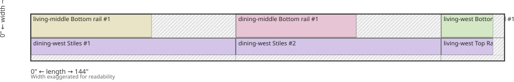
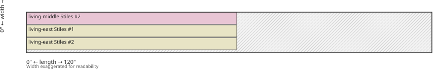
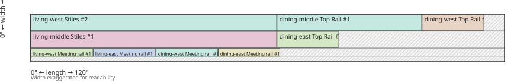
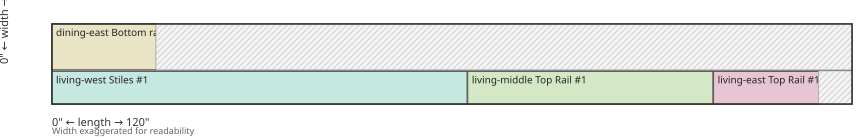

# Lumber cut plan

Kerf: 1/8"
Placed: 30 pieces
Waste: 1825 3/5 sq in (39.0%)
Windows completed: 6 of 6
Complete: dining-east, dining-middle, dining-west, living-east, living-middle, living-west
Unused stock: board-f, board-g, board-h

## board-a — 7 3/8" × 1" × 144"

### Cuts
- Sequence: through cross-cut (shorten long rips)
- Cross-cut @ 0" + 62 1/4" -> blank A
  - Rip @ 0" -> 2 1/2" strip
    - Cross-cut @ 0" + 62 1/4" -> dining-middle Stiles #1
  - Rip @ 2 5/8" -> 2 1/2" strip
    - Cross-cut @ 0" + 62 1/4" -> dining-middle Stiles #2
  - Rip @ 5 1/4" -> 1 1/4" strip
    - Cross-cut @ 0" + 36 3/4" -> living-middle Meeting rail #1
- Cross-cut @ 62 3/8" + 62 1/4" -> blank B
  - Rip @ 0" -> 2 1/2" strip
    - Cross-cut @ 62 3/8" + 62 1/4" -> dining-east Stiles #1
  - Rip @ 2 5/8" -> 2 1/2" strip
    - Cross-cut @ 62 3/8" + 62 1/4" -> dining-east Stiles #2
  - Rip @ 5 1/4" -> 1 1/4" strip
    - Cross-cut @ 62 3/8" + 36 5/8" -> dining-middle Meeting rail #1
- Leftover blank: 19 1/4" x 7 3/8"
  - Rip @ 0" -> 3 1/2" strip
    - Cross-cut @ 124 3/4" + 15 3/4" -> living-east Bottom rail #1
  - Rip @ 3 5/8" -> 3 1/2" strip
    - Cross-cut @ 124 3/4" + 15 5/8" -> dining-west Bottom rail #1

## board-b — 7" × 1" × 144"

### Cuts
- Sequence: through cross-cut (shorten long rips)
- Cross-cut @ 0" + 62 1/4" -> blank A
  - Rip @ 0" -> 3 1/2" strip
    - Cross-cut @ 0" + 36 3/4" -> living-middle Bottom rail #1
  - Rip @ 3 5/8" -> 2 1/2" strip
    - Cross-cut @ 0" + 62 1/4" -> dining-west Stiles #1
- Cross-cut @ 62 3/8" + 62 1/4" -> blank B
  - Rip @ 0" -> 3 1/2" strip
    - Cross-cut @ 62 3/8" + 36 5/8" -> dining-middle Bottom rail #1
  - Rip @ 3 5/8" -> 2 1/2" strip
    - Cross-cut @ 62 3/8" + 62 1/4" -> dining-west Stiles #2
- Leftover blank: 19 1/4" x 7"
  - Rip @ 0" -> 3 1/2" strip
    - Cross-cut @ 124 3/4" + 15 3/4" -> living-west Bottom rail #1
  - Rip @ 3 5/8" -> 2 1/2" strip
    - Cross-cut @ 124 3/4" + 15 3/4" -> living-west Top Rail #1

## board-c — 8 3/8" × 1" × 120"

### Cuts
- Sequence: cross-cut first (all parts 62 1/4")
- Cross-cut @ 0" + 62 1/4" -> blank A
  - Rip @ 0" -> 2 1/2" -> living-middle Stiles #2
  - Rip @ 2 5/8" -> 2 1/2" -> living-east Stiles #1
  - Rip @ 5 1/4" -> 2 1/2" -> living-east Stiles #2
- Offcut: 57 5/8" x 8 3/8" (full width)

## board-d — 7 1/4" × 1" × 120"

### Cuts
- Rip @ 0" -> 2 1/2" strip
  - Cross-cut @ 0" + 62 1/4" -> living-west Stiles #2
  - Cross-cut @ 62 3/8" + 36 5/8" -> dining-middle Top Rail #1
  - Cross-cut @ 99 1/8" + 15 5/8" -> dining-west Top Rail #1
- Rip @ 2 5/8" -> 2 1/2" strip
  - Cross-cut @ 0" + 62 1/4" -> living-middle Stiles #1
  - Cross-cut @ 62 3/8" + 15 5/8" -> dining-east Top Rail #1
- Rip @ 5 1/4" -> 1 1/4" strip
  - Cross-cut @ 0" + 15 3/4" -> living-west Meeting rail #1
  - Cross-cut @ 15 7/8" + 15 3/4" -> living-east Meeting rail #1
  - Cross-cut @ 31 3/4" + 15 5/8" -> dining-west Meeting rail #1
  - Cross-cut @ 47 1/2" + 15 5/8" -> dining-east Meeting rail #1

## board-e — 6 1/8" × 1" × 120"

### Cuts
- Rip @ 0" -> 3 1/2" strip
  - Cross-cut @ 0" + 15 5/8" -> dining-east Bottom rail #1
- Rip @ 3 5/8" -> 2 1/2" strip
  - Cross-cut @ 0" + 62 1/4" -> living-west Stiles #1
  - Cross-cut @ 62 3/8" + 36 3/4" -> living-middle Top Rail #1
  - Cross-cut @ 99 1/4" + 15 3/4" -> living-east Top Rail #1
